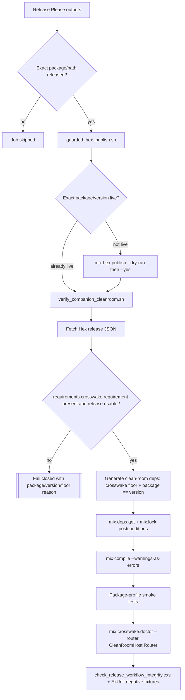

# Phase 144: Published-Core Compatibility & Clean-Room Proof - Research

**Researched:** 2026-07-07  
**Domain:** Elixir/Mix release proof, Hex package metadata, GitHub Actions release graph, clean-room package-family validation  
**Confidence:** MEDIUM

<user_constraints>
## User Constraints (from CONTEXT.md)

### Locked Decisions
## Implementation Decisions

### Dependency Proof Exactness
- **D-01:** The clean-room release proof must derive the `crosswake` floor from Hex release metadata for the exact published package/version under test, specifically the release's `requirements.crosswake.requirement`. Local `packages/${PACKAGE}/mix.exs` and `guides/companion_compatibility.md` are supporting drift guards, not the release-truth authority.
- **D-02:** The companion artifact under test must be installed exactly as `{:package, "== ${VERSION}"}` using the Release Please component version output. A range such as `~> 0.1` or `~> 0.2` is not acceptable for the companion package under test.
- **D-03:** The script must fail closed when the Hex release API returns 404, a mismatched version, a retired/unusable release state, missing `requirements.crosswake.requirement`, invalid semver input, or an unknown package outside the allowlisted Crosswake package family.
- **D-04:** After `mix deps.get`, the proof must assert the generated `mix.lock` contains the exact companion version and a selected `crosswake` version that satisfies the derived requirement. The selected core version is a postcondition, not the source of the floor.
- **D-05:** Preserve mixed companion floors as release truth: `crosswake_rulestead` and `crosswake_rindle` remain `~> 0.1`; `crosswake_sigra`, `crosswake_chimeway`, and `crosswake_threadline` remain `~> 0.2`. Do not normalize older-compatible packages upward for automation neatness.

### Fresh Router Doctor Proof
- **D-06:** `mix crosswake.doctor --router` should own loading/config readiness for host code. The idiomatic Mix shape is `@requirements ["app.config"]` or an equivalent doctor-owned mechanism, because the task interacts with user modules and runtime config. Do not require `app.start`; the doctor should not boot the host supervision tree, endpoint, or database just to inspect route policy.
- **D-07:** The clean-room harness may compile after writing `CleanRoomHost.Router` and appending runtime config, but it must not rely on a separate router pre-load as the proof. The command `mix crosswake.doctor --router CleanRoomHost.Router` itself must prove the fresh router is loadable.
- **D-08:** A minimal `defmodule CleanRoomHost.Router do use Phoenix.Router end` is sufficient for the positive fresh-router proof. It matches the phase goal: prove router module loading, not route-policy richness.
- **D-09:** Add regression coverage for the negative cases that matter to DX: module unavailable after host compile/config, module exists but is not a Phoenix router, and valid fresh router accepted. Failure microcopy should distinguish those cases instead of flattening everything into "router unavailable."

### Merge-Blocking Guardrails
- **D-10:** Keep `script/check_release_workflow_integrity.exs` plus ExUnit as the authoritative PREF-03 merge-blocking proof. It is deterministic, repo-local, idiomatic for this codebase, and can encode Crosswake-specific release identity policy that generic Actions linters cannot know.
- **D-11:** Do not introduce a YAML parser or generated release-graph contract in Phase 144 unless the current scanner becomes unable to express the required invariants. GitHub Actions expression semantics still require policy-aware string checks even with a structured YAML reader.
- **D-12:** `actionlint` can be an additive/advisory syntax check after pin validation, but it must not replace the semantic scanner. Current local evidence shows `actionlint 1.7.12` does not yet understand `queue: max`, while GitHub's current docs do.
- **D-13:** PREF-03 must fail on aggregate `releases_created` gates in behavioral jobs, stale or locally-derived dependency floors, proof jobs that can run before matching publish jobs, native proof cascades, missing mirror-token preflight, missing package-family members, comment-only or step-text false passes, missing `queue: max`, and `cancel-in-progress: true`.
- **D-14:** Guard failures should use stable check IDs and actionable messages. Negative fixture tests should mutate real workflow/script text and assert the intended check ID fails.

### Package Matrix Coverage
- **D-15:** Phase 144 covers all five release-managed companion/observer packages: `crosswake_rulestead`, `crosswake_rindle`, `crosswake_sigra`, `crosswake_chimeway`, and `crosswake_threadline`. A proof that only covers the newer `~> 0.2` packages would create inconsistent family guarantees.
- **D-16:** The packages share one structural proof contract: per-component Release Please gate, publish job success, exact Hex package/version identity, derived `crosswake` floor, clean-room compile, public-seam smoke test, and doctor proof.
- **D-17:** Semantic smoke tests are package-profile-specific, not copy/paste identical. `rulestead` and `rindle` use engine-present profiles; `sigra` and `chimeway` use no-engine companion profiles; `threadline` uses observer/module-shipment canaries and must not be registered under `:companions`.
- **D-18:** Absence is part of the proof. Chimeway must not pull in Sigra for release proof, and Threadline must install without Sigra or Chimeway. Optional engines are installed only in the engine-present profiles that intentionally prove them.

### Operator And Developer Experience
- **D-19:** Logs and failure copy should follow the current Brand Spec: calm, technical, and specific. Use `[crosswake]`, name the package, version, derived floor, selected core version, proof state, and next safe command or file to inspect.
- **D-20:** Hide backend mechanics unless they change the operator's next action. Operators need to know "which package/version was proven, against which core floor, and what failed"; they do not need raw registry JSON unless a field is missing or malformed.
- **D-21:** Keep the normal proof path boring: publish or already-live exact package -> Hex metadata floor -> clean-room deps -> compile -> smoke -> doctor -> cleanup/status. Avoid clever shortcuts that make release logs harder to audit.

### the agent's Discretion
Downstream agents may choose helper function names, exact JSON parsing mechanics, and test factoring. They should not revisit the policy decisions above unless official Hex, Mix, GitHub Actions, or Release Please behavior contradicts them.

### Deferred Ideas (OUT OF SCOPE)
- Full native registry recovery/backfill for SwiftPM and Maven Central remains Phase 145.
- Missing iOS `v0.2.0` mirror tag verification/backfill remains Phase 145.
- Full `mix crosswake.release.status` text/JSON/live-probe completion remains Phase 146.
- A graphical dashboard/operator UI remains DASH-01 and is out of scope for v18 Phase 144.
- A structured YAML parser or generated release-graph contract is deferred until the semantic scanner proves too brittle for the release policy surface.
- Actionlint may become an additive lane after its pinned version understands current GitHub `queue: max` syntax; it is not the authoritative PREF-03 proof.
- New runtime capabilities, native feature breadth, offline-sync productization, and companion package additions remain deferred behind v18 release integrity.
</user_constraints>

<phase_requirements>
## Phase Requirements

| ID | Description | Research Support |
|----|-------------|------------------|
| PREF-01 | Companion clean-room proof installs the exact just-published companion version and derives the required `crosswake` floor from the package under test. | Use Hex release metadata `requirements.crosswake.requirement` as authority, pin the package to `== ${VERSION}`, then assert `mix.lock` postconditions. [VERIFIED: .planning/REQUIREMENTS.md] [VERIFIED: script/verify_companion_cleanroom.sh] [VERIFIED: Hex API] |
| PREF-02 | `mix crosswake.doctor --router` can load a router from a freshly compiled clean-room host before failing with "router unavailable." | Move readiness into the doctor task, remove the script-level router pre-load as proof, and add fresh-router/non-router/unavailable regression tests. [VERIFIED: .planning/REQUIREMENTS.md] [VERIFIED: lib/mix/tasks/crosswake.doctor.ex] |
| PREF-03 | Release integrity has a merge-blocking static test that fails on aggregate gates, stale dependency floors, proof cascades, or missing mirror-token preflight. | Extend the existing scanner and negative-fixture ExUnit file with Phase 144 check IDs instead of creating a parallel verifier. [VERIFIED: .planning/REQUIREMENTS.md] [VERIFIED: script/check_release_workflow_integrity.exs] [VERIFIED: test/crosswake/proof/phase142_release_integrity_test.exs] |
</phase_requirements>

## Project Constraints (from AGENTS.md)

- Preserve Crosswake as a Phoenix-first route-policy and runtime-contract system, not a universal UI framework. [VERIFIED: AGENTS.md]
- Keep runtime ownership explicit per route; do not collapse designs into generic WebView wrapper behavior or LiveView-driven native rendering. [VERIFIED: AGENTS.md]
- Treat bridge contracts as semantic, typed, versioned, and low-frequency. [VERIFIED: AGENTS.md]
- Keep offline claims honest and distinguish cached read-only behavior from true local-first mutation. [VERIFIED: AGENTS.md]
- Treat diagnostics, support matrices, proof lanes, and rough-edge documentation as product surface. [VERIFIED: AGENTS.md]
- Respect v1/v18 scope boundaries before adding integrations or native breadth. [VERIFIED: AGENTS.md] [VERIFIED: .planning/PROJECT.md]

## Summary

Phase 144 should be planned as a hardening pass over existing v18 spillover, not a greenfield release subsystem. The workflow already contains per-component clean-room jobs for all five companion/observer packages, the Release Please outputs are already aliased by component, and the release integrity scanner plus ExUnit wrapper are green today. [VERIFIED: .github/workflows/release-please.yml] [VERIFIED: script/check_release_workflow_integrity.exs] [VERIFIED: test/crosswake/proof/phase142_release_integrity_test.exs]

The main implementation gap is precision. `script/verify_companion_cleanroom.sh` still derives `CORE_REQUIREMENT` from local `packages/$PACKAGE/mix.exs` or an env fallback before polling Hex, and it pre-loads `CleanRoomHost.Router` with `mix run -e` before invoking doctor. Those two behaviors are exactly what PREF-01 and PREF-02 need to replace or demote to non-proof setup. [VERIFIED: script/verify_companion_cleanroom.sh:80] [VERIFIED: script/verify_companion_cleanroom.sh:540]

Live Hex registry truth is mixed as of 2026-07-07: `crosswake_sigra` 0.1.1, `crosswake_chimeway` 0.1.0, and `crosswake_threadline` 0.1.0 return `requirements.crosswake.requirement = "~> 0.2"` and are not retired; `crosswake_rulestead` 0.1.0 and `crosswake_rindle` 0.1.0 return 404 from the Hex package API. The plan should use fixtures for deterministic static tests and make the real script fail closed on 404 rather than weakening D-15 package-family coverage. [VERIFIED: Hex API `https://hex.pm/api/packages/{package}/releases/{version}`]

**Primary recommendation:** Extend the existing script/scanner/test trio: Hex metadata parser + lockfile postcondition in `verify_companion_cleanroom.sh`, doctor-owned app config/load/compile behavior in `crosswake.doctor`, and Phase 144 check IDs/negative fixtures in `check_release_workflow_integrity.exs` and `phase142_release_integrity_test.exs`. [VERIFIED: codebase grep]

## Architectural Responsibility Map

| Capability | Primary Tier | Secondary Tier | Rationale |
|------------|--------------|----------------|-----------|
| Hex release metadata floor derivation | CI / Release Script | Hex.pm registry | The proof input is the exact published package release; local source is only a drift guard. [VERIFIED: 144-CONTEXT.md] [VERIFIED: Hex API] |
| Exact companion installation | Clean-room Mix host | Hex resolver / `mix.lock` | The throwaway host owns dependency resolution, while lockfile assertions prove selected package identity after `mix deps.get`. [CITED: https://hex.pm/docs/usage] [VERIFIED: script/verify_companion_cleanroom.sh] |
| Fresh router loading | Mix task | Clean-room host source | `mix crosswake.doctor --router` must compile/load host modules without starting app supervision. [VERIFIED: 144-CONTEXT.md] [CITED: https://hexdocs.pm/mix/Mix.Task.html] |
| Package-profile smoke tests | Clean-room host test stage | Package modules | Rulestead/Rindle, Sigra/Chimeway, and Threadline have different public seam canaries and absence invariants. [VERIFIED: script/verify_companion_cleanroom.sh] |
| Merge-blocking PREF-03 guardrails | ExUnit + semantic scanner | Release workflow YAML text | Existing repo pattern is deterministic scanner output asserted by ExUnit negative fixtures. [VERIFIED: script/check_release_workflow_integrity.exs] [VERIFIED: test/crosswake/proof/phase142_release_integrity_test.exs] |
| Native mirror preflight preservation | Static scanner only | Phase 145 workflow execution | Phase 144 should keep the existing preflight guard from regressing but leave mirror recovery/backfill to Phase 145. [VERIFIED: 144-CONTEXT.md] [VERIFIED: .github/workflows/release-please.yml] |

## Standard Stack

### Core

| Tool / Library | Version | Purpose | Why Standard |
|----------------|---------|---------|--------------|
| Elixir / Mix | Local `Elixir 1.19.5`, `Mix 1.19.5`; repo `.tool-versions` requests `elixir 1.19.5-otp-27` | Build package, run ExUnit, implement doctor task, inspect lockfile semantics | Existing project stack and CI setup use Mix tasks and ExUnit as the primary operator/proof surface. [VERIFIED: local command] [VERIFIED: .tool-versions] |
| Hex archive | Local archive `hex-2.5.0` | Publish, inspect, and resolve Hex packages | Existing publish and proof scripts rely on `mix hex.publish`, `mix hex.info`, and Hex release API. [VERIFIED: local command] [CITED: https://hex.hexdocs.pm/Mix.Tasks.Hex.Publish.html] |
| Bash + curl | `curl 8.7.1` locally | CI script orchestration and Hex API polling | Current release helpers are Bash scripts with `[crosswake]` operator copy and curl-based registry checks. [VERIFIED: local command] [VERIFIED: script/guarded_hex_publish.sh] |
| Python stdlib `json` | `Python 3.14.4` locally | JSON parsing and temporary `mix.exs` patching inside scripts | Existing clean-room script already uses Python stdlib for deterministic file patching; use the same for Hex JSON parsing if staying in Bash. [VERIFIED: local command] [VERIFIED: script/verify_companion_cleanroom.sh] |
| ExUnit | Bundled with Elixir 1.19.5 | Merge-blocking static and behavioral tests | Existing release proof wrapper is ExUnit and passed locally. [VERIFIED: test/test_helper.exs] [VERIFIED: local command] |
| GitHub Actions + Release Please action | Workflow pins `googleapis/release-please-action` commit for v4.1.3 | Release graph outputs, per-component gates, publish/proof jobs | Release Please emits aggregate `releases_created`, JSON `paths_released`, and path-prefixed outputs; Crosswake aliases these for exact gates. [VERIFIED: .github/workflows/release-please.yml] [CITED: https://github.com/googleapis/release-please-action#outputs] |

### Supporting

| Tool / Library | Version | Purpose | When to Use |
|----------------|---------|---------|-------------|
| Phoenix | Clean-room script installs `~> 1.8`; official docs opened at Phoenix 1.8.9 | Minimal `CleanRoomHost.Router` and router module proof | Required for the doctor fresh-router proof; a route-rich host is not needed. [VERIFIED: script/verify_companion_cleanroom.sh] [CITED: https://hexdocs.pm/phoenix/Phoenix.Router.html] |
| Phoenix LiveView | Clean-room script installs `~> 1.2` | Satisfies Crosswake/Phoenix host expectations during clean-room compile | Keep as existing script dependency unless implementation proves it unnecessary. [VERIFIED: script/verify_companion_cleanroom.sh] |
| GitHub CLI `gh` | Local `gh 2.95.0` | Existing release-as cleanup and issue creation | Phase 144 should not add new `gh` behavior, only preserve static scanner checks around workflow jobs. [VERIFIED: local command] [VERIFIED: .github/workflows/release-please.yml] |

### Alternatives Considered

| Instead of | Could Use | Tradeoff |
|------------|-----------|----------|
| Existing semantic scanner | YAML parser + policy layer | Deferred by locked D-11; current scanner already encodes Crosswake-specific release identity and negative fixtures. [VERIFIED: 144-CONTEXT.md] |
| Bash string comparison for versions | Elixir `Version.match?/2` via `mix run` or `elixir -e` | Use Elixir version semantics for the lockfile postcondition; shell regex is acceptable only for basic input shape. [CITED: https://hexdocs.pm/elixir/Version.html] |
| Live Hex calls in unit tests | Fixture files + env-overridden helper paths | Use live Hex only in the real release proof; deterministic ExUnit should mutate fixture text and fake JSON/HTTP outcomes. [VERIFIED: test/crosswake/proof/phase142_release_integrity_test.exs] |

**Installation:** No new repo dependency should be added for Phase 144. [VERIFIED: 144-CONTEXT.md]

**Version verification:** Versions and tools were checked with `elixir --version`, `mix --version`, `curl --version`, `python3 --version`, `gh --version`, and live Hex API requests on 2026-07-07. [VERIFIED: local command] [VERIFIED: Hex API]

## Package Legitimacy Audit

> Phase 144 should not add npm, PyPI, crates, or new Hex dependencies to the repository. The GSD package-legitimacy seam supports npm/PyPI/crates and was not applicable to existing Hex package-family members. [VERIFIED: 144-CONTEXT.md] [VERIFIED: gsd-tools protocol]

| Package | Registry | Age | Downloads | Source Repo | Verdict | Disposition |
|---------|----------|-----|-----------|-------------|---------|-------------|
| `crosswake` | Hex | Published versions include `0.2.0` on 2026-07-03 | `mix hex.info` reported 42 last-7-days downloads locally | `github.com/szTheory/crosswake` | Existing project package | Approved input to proof. [VERIFIED: `mix hex.info crosswake`] |
| `crosswake_sigra` | Hex | Release `0.1.1` inserted 2026-07-03 | Not queried | `github.com/szTheory/crosswake` | Existing project package | Approved; live metadata has `crosswake ~> 0.2`. [VERIFIED: Hex API] |
| `crosswake_chimeway` | Hex | Release `0.1.0` inserted 2026-07-04 | Not queried | `github.com/szTheory/crosswake` | Existing project package | Approved; live metadata has `crosswake ~> 0.2`. [VERIFIED: Hex API] |
| `crosswake_threadline` | Hex | Release `0.1.0` inserted 2026-07-04 | Not queried | `github.com/szTheory/crosswake` | Existing project package | Approved; live metadata has `crosswake ~> 0.2` and optional `plug` / `phoenix_live_view`. [VERIFIED: Hex API] |
| `crosswake_rulestead` | Hex | Release `0.1.0` returned 404 on 2026-07-07 | Not available | `github.com/szTheory/crosswake` | Existing planned package, not live at queried coordinate | Keep static coverage; real clean-room proof must fail closed on 404. [VERIFIED: Hex API] |
| `crosswake_rindle` | Hex | Release `0.1.0` returned 404 on 2026-07-07 | Not available | `github.com/szTheory/crosswake` | Existing planned package, not live at queried coordinate | Keep static coverage; real clean-room proof must fail closed on 404. [VERIFIED: Hex API] |

**Packages removed due to [SLOP] verdict:** none. [VERIFIED: codebase]  
**Packages flagged as suspicious [SUS]:** none; no new package names are recommended. [VERIFIED: codebase]

## Architecture Patterns

### System Architecture Diagram



### Recommended Project Structure

```text
script/
├── verify_companion_cleanroom.sh        # Hex metadata, clean-room deps, lockfile postconditions, smoke, doctor proof
├── guarded_hex_publish.sh               # Existing exact publish/already-live helper
└── check_release_workflow_integrity.exs # Static PREF-03 semantic guard IDs
lib/mix/tasks/
└── crosswake.doctor.ex                  # Doctor-owned app config/load/compile router readiness
test/crosswake/proof/
├── phase142_release_integrity_test.exs  # Extend or tag with Phase 144 scanner negative fixtures
└── phase144_cleanroom_exactness_test.exs # Optional new focused script-fixture tests if the existing file grows too broad
test/mix/tasks/
└── crosswake_doctor_router_test.exs     # Fresh router, non-router, unavailable module DX coverage
```

### Pattern 1: Registry-Truth Floor, Lockfile Postcondition

**What:** Fetch exact Hex release JSON, derive `requirements.crosswake.requirement`, install `{PACKAGE, "== ${VERSION}"}`, then assert selected lockfile versions. [VERIFIED: 144-CONTEXT.md] [VERIFIED: Hex API]  
**When to use:** Every release-triggered companion clean-room proof. [VERIFIED: .github/workflows/release-please.yml]

**Example:**

```bash
# Source: Hex release API + Elixir Version docs
# Keep curl/Python parsing small; use Elixir Version.match? for requirement semantics.
release_json="$(curl -fsS "https://hex.pm/api/packages/${PACKAGE}/releases/${VERSION}")"
CORE_REQUIREMENT="$(
  printf '%s' "$release_json" |
    python3 -c 'import json,sys; print(json.load(sys.stdin)["requirements"]["crosswake"]["requirement"])'
)"
PACKAGE_REQUIREMENT="== ${VERSION}"

mix deps.get
mix run -e '
  lock = Code.eval_file("mix.lock") |> elem(0)
  {:hex, :crosswake, core_vsn, _, _, _, _, _, _} = Map.fetch!(lock, :crosswake)
  {:hex, package, package_vsn, _, _, _, _, _, _} = Map.fetch!(lock, String.to_atom(System.fetch_env!("PACKAGE")))
  requirement = Version.parse_requirement!(System.fetch_env!("CORE_REQUIREMENT"))
  true = Version.match?(Version.parse!(core_vsn), requirement)
  true = package_vsn == System.fetch_env!("VERSION")
'
```

### Pattern 2: Doctor Owns Router Readiness

**What:** Make the Mix task run app config/load readiness and compile/reload enough to resolve host modules, without starting the host app. [VERIFIED: 144-CONTEXT.md] [CITED: https://hexdocs.pm/mix/Mix.Task.html]  
**When to use:** `mix crosswake.doctor --router Some.Router` in a clean-room host or adopter app. [VERIFIED: lib/mix/tasks/crosswake.doctor.ex]

**Example:**

```elixir
# Source: Mix.Task docs and Phase 144 D-06
defmodule Mix.Tasks.Crosswake.Doctor do
  use Mix.Task

  @requirements ["app.config"]

  def run(args) do
    Mix.Task.run("compile")
    # parse args, load router, then call Crosswake.Doctor.run/1
  end
end
```

### Pattern 3: Static Guard IDs With Negative Fixtures

**What:** Add named scanner checks and mutate real workflow/script text in tests to prove each check fails for the intended regression. [VERIFIED: test/crosswake/proof/phase142_release_integrity_test.exs]  
**When to use:** PREF-03 invariants: Hex metadata floor, exact pin, lockfile assertion, package matrix, doctor requirement, and proof-after-publish. [VERIFIED: 144-CONTEXT.md]

**Example:**

```elixir
# Source: existing phase142_release_integrity_test.exs pattern
@phase144_ids ~w(
  release.cleanroom.hex_metadata_floor
  release.cleanroom.exact_companion_pin
  release.cleanroom.lockfile_postcondition
  release.cleanroom.package_matrix_complete
  release.doctor.app_config_requirement
  release.doctor.fresh_router_loaded
)
```

### Anti-Patterns to Avoid

- **Local package floor as release truth:** `packages/$PACKAGE/mix.exs` is a drift guard only; Hex release metadata owns the proof floor. [VERIFIED: script/verify_companion_cleanroom.sh:80] [VERIFIED: 144-CONTEXT.md]
- **A version pin without lockfile verification:** Writing `== ${VERSION}` into clean-room deps is insufficient unless `mix.lock` confirms the selected version. [VERIFIED: 144-CONTEXT.md] [CITED: https://hex.pm/docs/usage]
- **Doctor proof masked by script pre-load:** `mix run -e 'Code.ensure_loaded?...'` before doctor proves the script can load the router, not that doctor can. [VERIFIED: script/verify_companion_cleanroom.sh:540]
- **Threadline as a companion registrant:** Threadline is an observer and must not be added to `:companions`. [VERIFIED: guides/companion_compatibility.md:37] [VERIFIED: script/verify_companion_cleanroom.sh]
- **Chimeway pulling Sigra in release proof:** Chimeway has a test-only path dep locally, but published clean-room proof must install no Sigra sibling. [VERIFIED: packages/crosswake_chimeway/mix.exs] [VERIFIED: script/verify_companion_cleanroom.sh]

## Don't Hand-Roll

| Problem | Don't Build | Use Instead | Why |
|---------|-------------|-------------|-----|
| SemVer requirement matching | Bash string/range parser | `Version.parse_requirement!/1` and `Version.match?/2` | Elixir owns `~>` and pre-release semantics; Hex uses Version requirements. [CITED: https://hexdocs.pm/elixir/Version.html] |
| Hex release JSON parsing | grep for `"version"` as the authority | Python `json` or Elixir JSON parser on the release response | The script must distinguish version mismatch, missing requirement, retirement, and 404. [VERIFIED: script/verify_companion_cleanroom.sh:125] [VERIFIED: Hex API] |
| Workflow policy proof | Generic YAML linter as authority | Existing `check_release_workflow_integrity.exs` | Crosswake-specific release identity policy is semantic and already has ExUnit negative fixtures. [VERIFIED: script/check_release_workflow_integrity.exs] |
| Router loading proof | Separate `mix run -e Code.ensure_loaded?` pre-load | `mix crosswake.doctor --router` task readiness | PREF-02 requires the doctor command itself to prove fresh router loading. [VERIFIED: 144-CONTEXT.md] |
| Package matrix enumeration | Ad hoc repeated shell blocks | Central `@components`, `@hex_packages`, and package-profile mapping | Existing scanner already centralizes five package names; extend that source of truth. [VERIFIED: script/check_release_workflow_integrity.exs:10] |

**Key insight:** Phase 144 is about authority boundaries: release facts come from Hex metadata, selected versions come from `mix.lock`, router readiness comes from doctor, and merge-blocking policy comes from the repo-local scanner. [VERIFIED: 144-CONTEXT.md]

## Common Pitfalls

### Pitfall 1: Local Floors Masquerade As Published Floors
**What goes wrong:** The proof says it tested the package's floor but actually scraped local source. [VERIFIED: script/verify_companion_cleanroom.sh:80]  
**Why it happens:** The in-repo package exists during CI checkout and is easier to grep than the published release metadata. [VERIFIED: codebase]  
**How to avoid:** Fetch `https://hex.pm/api/packages/${PACKAGE}/releases/${VERSION}` and require `requirements.crosswake.requirement`. [VERIFIED: Hex API]  
**Warning signs:** `CORE_REQUIREMENT=$(grep ... packages/$PACKAGE/mix.exs)` remains in the script. [VERIFIED: script/verify_companion_cleanroom.sh:80]

### Pitfall 2: Exact Pin Without Lockfile Proof
**What goes wrong:** The generated `mix.exs` looks exact, but the proof never verifies the resolver selected that exact package and a compatible core. [VERIFIED: 144-CONTEXT.md]  
**Why it happens:** `mix deps.get` may resolve unlocked dependencies and writes `mix.lock`; the postcondition lives after resolution. [CITED: https://hex.pm/docs/usage]  
**How to avoid:** Assert `mix.lock` package version equals `${VERSION}` and `crosswake` satisfies `CORE_REQUIREMENT`. [VERIFIED: 144-CONTEXT.md]  
**Warning signs:** No check ID like `release.cleanroom.lockfile_postcondition`. [VERIFIED: script/check_release_workflow_integrity.exs]

### Pitfall 3: Doctor Fresh-Router Proof Is Pre-Proven Outside Doctor
**What goes wrong:** The script loads `CleanRoomHost.Router` before doctor, hiding whether the doctor task can prepare host code itself. [VERIFIED: script/verify_companion_cleanroom.sh:540]  
**Why it happens:** The current task runs `Mix.Task.run("compile")` internally but lacks explicit requirements and targeted fresh-router tests. [VERIFIED: lib/mix/tasks/crosswake.doctor.ex:100]  
**How to avoid:** Add `@requirements ["app.config"]`, keep compile readiness inside the task, and remove the script-level pre-load as a proof step. [VERIFIED: 144-CONTEXT.md] [CITED: https://hexdocs.pm/mix/Mix.Task.html]  
**Warning signs:** `mix run -e 'Code.ensure_loaded?...'` remains immediately before `mix crosswake.doctor`. [VERIFIED: script/verify_companion_cleanroom.sh:541]

### Pitfall 4: Live 404 Becomes A Silent Skip
**What goes wrong:** Missing published packages get treated as "not applicable" and D-15 coverage erodes. [VERIFIED: Hex API]  
**Why it happens:** Current live API returns 404 for `crosswake_rulestead` 0.1.0 and `crosswake_rindle` 0.1.0 while release graph/docs still list them. [VERIFIED: Hex API] [VERIFIED: .release-please-manifest.json]  
**How to avoid:** Static tests cover all five; real script fails closed on 404 with package/version-specific copy. [VERIFIED: 144-CONTEXT.md]  
**Warning signs:** Tests only enumerate Sigra/Chimeway/Threadline because they are live today. [VERIFIED: codebase]

### Pitfall 5: Release Status Claims Phase 144 Before It Is Hardened
**What goes wrong:** The adjacent `release.cleanroom_dependency_floor` check becomes green from shallow string checks. [VERIFIED: lib/crosswake/release_status.ex:436]  
**Why it happens:** `cleanroom_script_hardened?/1` currently checks for variables and generated dep strings, not Hex metadata authority or lockfile postconditions. [VERIFIED: lib/crosswake/release_status.ex:436]  
**How to avoid:** Either leave it warning until Phase 146 owns STAT, or update it only after Phase 144 static IDs prove the stronger conditions. [VERIFIED: test/mix/tasks/crosswake_release_status_test.exs]

## Code Examples

### Hex Metadata Parser Guard

```bash
# Source: Hex API response shape verified against crosswake_sigra/chimeway/threadline on 2026-07-07
parse_core_requirement() {
  python3 -c '
import json, sys
payload = json.load(sys.stdin)
if payload.get("retirement") or payload.get("retired"):
    raise SystemExit("retired release")
if payload.get("version") != sys.argv[1]:
    raise SystemExit("version mismatch")
req = payload.get("requirements", {}).get("crosswake", {}).get("requirement")
if not req:
    raise SystemExit("missing requirements.crosswake.requirement")
print(req)
' "$VERSION"
}
```

### Doctor Fresh-Router Regression Shape

```elixir
# Source: Phase 144 D-09; place in test/mix/tasks/crosswake_doctor_router_test.exs
test "doctor accepts a freshly compiled Phoenix router without external pre-load" do
  # create temp Mix project, write CleanRoomHost.Router using Phoenix.Router,
  # then invoke the task in that project and assert it reaches Doctor.run/1.
end

test "doctor distinguishes unavailable module from non-router module" do
  # assert unavailable copy names module unavailable;
  # assert non-router copy names module loaded but not a Phoenix router.
end
```

### Scanner Check ID Additions

```elixir
# Source: script/check_release_workflow_integrity.exs existing check/3 pattern
check(
  "release.cleanroom.hex_metadata_floor",
  includes?(cleanroom_script, "requirements") and
    includes?(cleanroom_script, "requirements.crosswake.requirement") and
    not includes?(cleanroom_script, "grep -E 'do: \\{:crosswake"),
  "clean-room proof must derive core floor from Hex release metadata, not local mix.exs"
)
```

## State of the Art

| Old Approach | Current Approach | When Changed | Impact |
|--------------|------------------|--------------|--------|
| Aggregate `releases_created` for behavioral jobs | Exact `paths_released` and component aliases | Locked in Phases 142-143 | Prevents companion-only releases from publishing core/native artifacts. [VERIFIED: .github/workflows/release-please.yml] [CITED: https://github.com/googleapis/release-please-action#outputs] |
| `cancel-in-progress: false` only | `cancel-in-progress: false` plus `queue: max` | Phase 142 | Prevents newer pending release runs from replacing older pending release runs. [VERIFIED: .github/workflows/release-please.yml] [CITED: https://docs.github.com/en/actions/how-tos/write-workflows/choose-when-workflows-run/control-workflow-concurrency] |
| Direct `mix hex.publish --yes` in workflow | Shared guarded helper with already-live success | Phase 143 | Recovery/rerun converges to proof instead of duplicate-publish failure. [VERIFIED: script/guarded_hex_publish.sh] |
| Local package source as floor authority | Hex release metadata as floor authority | Phase 144 target | Required to prove the package as published, not as checked out. [VERIFIED: 144-CONTEXT.md] |
| Router pre-load before doctor | Doctor-owned router readiness | Phase 144 target | Required for fresh-router DX and clean-room proof validity. [VERIFIED: 144-CONTEXT.md] |

**Deprecated/outdated:**
- `script/verify_companion_cleanroom.sh` local `CORE_REQUIREMENT` grep is outdated for release proof. [VERIFIED: script/verify_companion_cleanroom.sh:80]
- `mix run -e Code.ensure_loaded?` immediately before doctor is outdated as a proof step. [VERIFIED: script/verify_companion_cleanroom.sh:541]
- The `release.cleanroom_dependency_floor` release-status string check is not sufficient to claim PREF completion. [VERIFIED: lib/crosswake/release_status.ex:436]

## Assumptions Log

| # | Claim | Section | Risk if Wrong |
|---|-------|---------|---------------|
| — | No unverified assumptions are needed for planning. All recommendations are grounded in CONTEXT.md, local code reads, official docs, local tool probes, or live Hex API checks from this session. | All | — |

## Open Questions

1. **Are `crosswake_rulestead` and `crosswake_rindle` intentionally not live on Hex at `0.1.0` as of 2026-07-07?**  
   - What we know: Hex API returns 404 for both package names/versions, while release config, manifest, and guide list them as release-managed `0.1.0` packages. [VERIFIED: Hex API] [VERIFIED: release-please-config.json] [VERIFIED: .release-please-manifest.json]  
   - What's unclear: Whether those releases were never cut, deleted, renamed, or blocked by pending Release PRs. [VERIFIED: Hex API]  
   - Recommendation: Do not weaken Phase 144. Keep static coverage for all five packages, make live proof fail closed on 404, and leave broader release-status presentation to Phase 146. [VERIFIED: 144-CONTEXT.md]

2. **Should Phase 144 update `Crosswake.ReleaseStatus.cleanroom_script_hardened?/1` now or leave it warning until Phase 146?**  
   - What we know: The current status check intentionally says PREF validation remains Phase 144 and uses shallow script string checks. [VERIFIED: lib/crosswake/release_status.ex] [VERIFIED: test/mix/tasks/crosswake_release_status_test.exs]  
   - What's unclear: Whether the planner wants status output reconciled immediately or only static scanner proof in Phase 144. [VERIFIED: 144-CONTEXT.md]  
   - Recommendation: Keep Phase 144 focused on scanner/test truth; only update release-status if needed to avoid false "hardened" output. [VERIFIED: 144-CONTEXT.md]

## Environment Availability

| Dependency | Required By | Available | Version | Fallback |
|------------|-------------|-----------|---------|----------|
| Elixir | ExUnit, Mix tasks, scanner | ✓ | 1.19.5 local, compiled with OTP 28 | CI uses `.tool-versions`; local OTP mismatch should not change plan. [VERIFIED: local command] [VERIFIED: .tool-versions] |
| Mix | Build/test/doctor | ✓ | 1.19.5 | None needed. [VERIFIED: local command] |
| Hex archive | Hex info/publish/proof | ✓ | 2.5.0 installed; auth session expired locally but public queries worked | CI installs Hex/Rebar before publish/proof. [VERIFIED: local command] [VERIFIED: .github/workflows/release-please.yml] |
| curl | Hex API polling | ✓ | 8.7.1 | Python urllib works for tests; script already uses curl. [VERIFIED: local command] |
| Python3 | JSON parsing / script patching | ✓ | 3.14.4 | Elixir JSON parser if desired. [VERIFIED: local command] |
| Git | Checkout/ref identity | ✓ | 2.41.0 | None. [VERIFIED: local command] |
| GitHub CLI | Existing cleanup/alert workflow | ✓ | 2.95.0 | Not required for local Phase 144 tests. [VERIFIED: local command] |
| Hex.pm public API | Release metadata proof | ✓ for live public network | 200 for crosswake/sigra/chimeway/threadline; 404 for rulestead/rindle queried versions | Deterministic tests should use fixtures; real release proof fails closed. [VERIFIED: Hex API] |

**Missing dependencies with no fallback:** none for local research/planning. [VERIFIED: local command]  
**Missing dependencies with fallback:** `ctx7` CLI not installed; official docs were fetched directly. [VERIFIED: local command]

## Validation Architecture

### Test Framework

| Property | Value |
|----------|-------|
| Framework | ExUnit bundled with Elixir/Mix 1.19.5. [VERIFIED: local command] |
| Config file | `test/test_helper.exs`. [VERIFIED: test/test_helper.exs] |
| Quick run command | `elixir script/check_release_workflow_integrity.exs && mix test test/crosswake/proof/phase142_release_integrity_test.exs`. [VERIFIED: local command] |
| Full suite command | `mix verify`. [VERIFIED: mix.exs] |

### Phase Requirements -> Test Map

| Req ID | Behavior | Test Type | Automated Command | File Exists? |
|--------|----------|-----------|-------------------|--------------|
| PREF-01 | Exact package pin, Hex metadata-derived floor, and lockfile postconditions | unit/static + release-script fixture | `mix test test/crosswake/proof/phase142_release_integrity_test.exs --only phase144_cleanroom -x` | ❌ Wave 0 for stronger tests. [VERIFIED: test/crosswake/proof/phase142_release_integrity_test.exs] |
| PREF-02 | Doctor loads fresh router itself and distinguishes unavailable/non-router failures | Mix task integration | `mix test test/mix/tasks/crosswake_doctor_router_test.exs -x` | ❌ Wave 0. [VERIFIED: lib/mix/tasks/crosswake.doctor.ex] |
| PREF-03 | Static scanner fails aggregate gates, stale/local floors, missing lockfile proof, proof cascades, missing mirror-token preflight | scanner + ExUnit negative fixtures | `elixir script/check_release_workflow_integrity.exs && mix test test/crosswake/proof/phase142_release_integrity_test.exs -x` | ✅ existing base; ❌ Phase 144 IDs missing. [VERIFIED: local command] |

### Sampling Rate
- **Per task commit:** `mix test test/crosswake/proof/phase142_release_integrity_test.exs -x` or the focused new Phase 144 test file. [VERIFIED: codebase]  
- **Per wave merge:** `elixir script/check_release_workflow_integrity.exs && mix test test/crosswake/proof/phase142_release_integrity_test.exs && mix test test/mix/tasks/crosswake_doctor_router_test.exs`. [VERIFIED: codebase]  
- **Phase gate:** `mix verify` plus the two targeted release/doctor commands above. [VERIFIED: mix.exs]

### Wave 0 Gaps
- [ ] Add Phase 144 scanner IDs to `script/check_release_workflow_integrity.exs`: `release.cleanroom.hex_metadata_floor`, `release.cleanroom.exact_companion_pin`, `release.cleanroom.lockfile_postcondition`, `release.cleanroom.package_matrix_complete`, `release.doctor.app_config_requirement`, and `release.doctor.fresh_router_loaded`. [VERIFIED: 144-CONTEXT.md]
- [ ] Add negative fixture tests for local-floor grep, missing exact pin, missing lockfile assertion, missing package family member, and doctor pre-load masking. [VERIFIED: test/crosswake/proof/phase142_release_integrity_test.exs]
- [ ] Add Mix task router tests for fresh Phoenix router accepted, module unavailable, and module exists but is not a Phoenix router. [VERIFIED: 144-CONTEXT.md]

## Security Domain

### Applicable ASVS Categories

| ASVS Category | Applies | Standard Control |
|---------------|---------|------------------|
| V2 Authentication | no | No auth/session feature is changed; CI uses existing `HEX_API_KEY` / mirror secrets only. [VERIFIED: .github/workflows/release-please.yml] |
| V3 Session Management | no | No application session state. [VERIFIED: 144-CONTEXT.md] |
| V4 Access Control | yes | Allowlist package names and reject unknown packages before registry/file interpolation. [VERIFIED: 144-CONTEXT.md] |
| V5 Input Validation | yes | Validate semver, package allowlist, JSON fields, lockfile selected versions, and GitHub output identities. [VERIFIED: script/verify_companion_cleanroom.sh] [CITED: https://hexdocs.pm/elixir/Version.html] |
| V6 Cryptography | no | Do not add custom crypto; preserve secret handling and avoid printing tokens. [VERIFIED: .github/workflows/release-please.yml] |

### Known Threat Patterns for Release Proof

| Pattern | STRIDE | Standard Mitigation |
|---------|--------|---------------------|
| Package/version injection into URL or generated `mix.exs` | Tampering | Package allowlist plus semver validation before interpolation. [VERIFIED: 144-CONTEXT.md] [VERIFIED: script/verify_companion_cleanroom.sh] |
| Registry response shape mismatch or missing requirement | Tampering / DoS | Parse JSON structurally and fail closed on 404, mismatched version, retirement, or missing `requirements.crosswake.requirement`. [VERIFIED: 144-CONTEXT.md] [VERIFIED: Hex API] |
| Wrong package selected by dependency resolver | Tampering | Assert `mix.lock` after `mix deps.get`; selected package equals exact version and selected core matches derived requirement. [VERIFIED: 144-CONTEXT.md] [CITED: https://hex.pm/docs/usage] |
| Secret leakage in CI logs | Information Disclosure | Keep `[crosswake]` output to package/version/floor/proof state; do not print raw token URLs. [VERIFIED: brandbook/BRAND-SPEC.md] [VERIFIED: .github/workflows/release-please.yml] |
| Aggregate release gate causes unintended publish/proof | Elevation of Privilege / Tampering | Keep exact `paths_released` / component gates and scanner negative fixtures. [VERIFIED: .github/workflows/release-please.yml] [CITED: https://github.com/googleapis/release-please-action#outputs] |

## Sources

### Primary (HIGH confidence)
- `AGENTS.md` - project constraints and workflow directives. [VERIFIED: codebase]
- `.planning/phases/144-published-core-compatibility-clean-room-proof/144-CONTEXT.md` - locked Phase 144 decisions and deferred scope. [VERIFIED: codebase]
- `.planning/REQUIREMENTS.md`, `.planning/ROADMAP.md`, `.planning/STATE.md` - PREF mapping, phase boundary, and current implementation spillover. [VERIFIED: codebase]
- `.github/workflows/release-please.yml`, `.github/workflows/hex-publish.yml`, `release-please-config.json`, `.release-please-manifest.json` - release graph and job wiring. [VERIFIED: codebase]
- `script/verify_companion_cleanroom.sh`, `script/check_release_workflow_integrity.exs`, `script/guarded_hex_publish.sh` - current proof implementation. [VERIFIED: codebase]
- `lib/mix/tasks/crosswake.doctor.ex`, `lib/crosswake/doctor/doctor.ex` - doctor task and report behavior. [VERIFIED: codebase]
- Live Hex API URLs for `crosswake`, `crosswake_sigra`, `crosswake_chimeway`, `crosswake_threadline`, `crosswake_rulestead`, and `crosswake_rindle` release metadata. [VERIFIED: Hex API]

### Secondary (MEDIUM confidence)
- https://hex.pm/docs/usage - dependency requirements and lockfile resolution. [CITED: hex.pm/docs/usage]
- https://hex.pm/docs/publish - package publish constraints and production dependencies. [CITED: hex.pm/docs/publish]
- https://hex.hexdocs.pm/Mix.Tasks.Hex.Publish.html - `mix hex.publish`, `--dry-run`, `--yes`, `--replace`, and revert/update windows. [CITED: hex.hexdocs.pm/Mix.Tasks.Hex.Publish.html]
- https://hexdocs.pm/elixir/Version.html - requirement syntax and `~>` semantics. [CITED: hexdocs.pm/elixir/Version.html]
- https://hexdocs.pm/mix/Mix.Task.html - Mix task callbacks and requirements introspection. [CITED: hexdocs.pm/mix/Mix.Task.html]
- https://hexdocs.pm/mix/Mix.Tasks.Compile.html - `mix compile` behavior and warnings-as-errors. [CITED: hexdocs.pm/mix/Mix.Tasks.Compile.html]
- https://hexdocs.pm/elixir/Code.html - `ensure_compiled` caveats. [CITED: hexdocs.pm/elixir/Code.html]
- https://hexdocs.pm/phoenix/Phoenix.Router.html - router module and macro shape. [CITED: hexdocs.pm/phoenix/Phoenix.Router.html]
- https://docs.github.com/en/actions/how-tos/write-workflows/choose-when-workflows-run/control-workflow-concurrency - `queue: max` and cancellation behavior. [CITED: docs.github.com]
- https://docs.github.com/en/actions/reference/workflows-and-actions/expressions - `contains(fromJSON(...), item)` and output string semantics. [CITED: docs.github.com]
- https://docs.github.com/en/actions/reference/workflows-and-actions/contexts - `needs.<job_id>.result`. [CITED: docs.github.com]
- https://github.com/googleapis/release-please-action#outputs - Release Please outputs. [CITED: github.com/googleapis/release-please-action]

### Tertiary (LOW confidence)
- None used for decisions. [VERIFIED: research log]

## Metadata

**Confidence breakdown:**
- Standard stack: MEDIUM - local code/tool probes are direct, but external docs were fetched without Context7 because no Context7 MCP/CLI was available. [VERIFIED: local command] [CITED: official docs]
- Architecture: HIGH - phase boundaries, proof locations, and package profiles are from local code and locked context. [VERIFIED: codebase]
- Pitfalls: HIGH - each pitfall maps to a current file line, locked decision, or live Hex API result. [VERIFIED: codebase] [VERIFIED: Hex API]
- Live registry state: MEDIUM - observed on 2026-07-07; registry state can change after releases. [VERIFIED: Hex API]

**Research date:** 2026-07-07  
**Valid until:** 2026-07-14 for live registry and GitHub Actions semantics; local code findings remain valid until changed. [VERIFIED: research timestamp]
