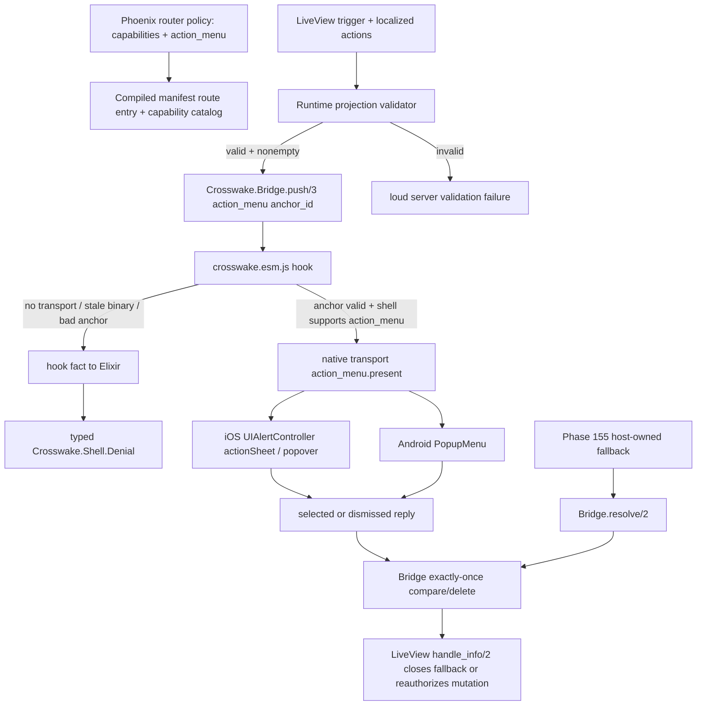

# Phase 156: Native Menu & Action-Button Control - Research

**Researched:** 2026-07-31
**Domain:** Phoenix LiveView bridge contracts, route policy, iOS UIKit action sheets, Android PopupMenu, native contract-vector proof
**Confidence:** HIGH

<user_constraints>
## User Constraints (from CONTEXT.md)

### Locked Decisions

- **D-01:** **The Phase 156 action button is Phoenix-owned.** It is an ordinary, accessible button in the LiveView that opens the already-rendered Phase 155 fallback and invokes `Crosswake.Bridge.push(socket, "action_menu", ...)` as native enhancement. The wire command remains `action_menu.present`. [VERIFIED: `.planning/phases/156-native-menu-action-button-control/156-CONTEXT.md`]
- **D-05:** `Bridge.push/3` gains an **explicit `anchor_id:` option for `action_menu`**. The adopter passes the exact DOM id of the Phoenix trigger; the hook resolves only that id and measures it. [VERIFIED: `.planning/phases/156-native-menu-action-button-control/156-CONTEXT.md`]
- **D-08/D-09:** Add one sibling route-policy key, `action_menu:`, paired with `capabilities: ["action_menu"]`; Phase 156 supports one default action-menu contract per route with `actions` and `fallback: :generated`. [VERIFIED: `.planning/phases/156-native-menu-action-button-control/156-CONTEXT.md`]
- **D-12/D-13:** Each invocation supplies the frozen Phase 155 action shape `%{id, label, destructive, icon}`; selectable ids must be a subset of route-policy ids, `destructive` must match policy, `icon` must stay `nil`, labels must be nonblank, and selectable ids must be unique. [VERIFIED: `.planning/phases/156-native-menu-action-button-control/156-CONTEXT.md`]
- **D-17/D-20:** Use platform-adaptive native chrome: iOS `UIAlertController.Style.actionSheet` with iPad popover anchoring; Android `PopupMenu` anchored through a bounded adapter; parity is semantic, not pixel-identical. [VERIFIED: `.planning/phases/156-native-menu-action-button-control/156-CONTEXT.md`]
- **D-26:** Native success returns exactly one `status: :ok` reply with `%{"outcome" => "selected", "action_id" => id}` or `%{"outcome" => "dismissed"}`. [VERIFIED: `.planning/phases/156-native-menu-action-button-control/156-CONTEXT.md`]
- **D-31/D-33/D-34:** Bump `Crosswake.Bridge.Contract` to additive `1.2.0`, widen native request payloads from string maps to structured JSON values, and correct the old-shell path by preflighting shell-injected `action_menu` capability/version facts before posting an unknown command. [VERIFIED: `.planning/phases/156-native-menu-action-button-control/156-CONTEXT.md`]
- **D-35/D-37:** Extend the canonical `test/fixtures/bridge_contract_vectors.json`; both native harnesses must consume the committed vectors without simulator/emulator proof claims. [VERIFIED: `.planning/phases/156-native-menu-action-button-control/156-CONTEXT.md`]
- **D-38:** Telemetry is bounded and PII-free: route id, capability, command, outcome, denial reason, and bounded action count are allowed; labels, action ids, DOM ids, raw coordinates, record ids, and adopter `ref` are forbidden. [VERIFIED: `.planning/phases/156-native-menu-action-button-control/156-CONTEXT.md`]

### the agent's Discretion

The user delegated private type/module names, the bounded native anchor adapter's internal implementation, exact conservative action/label ceilings, test-file organization, and developer-facing microcopy, provided the public shapes, failure layering, authority boundaries, accessibility semantics, and proof non-claims remain intact. [VERIFIED: `.planning/phases/156-native-menu-action-button-control/156-CONTEXT.md`]

### Deferred Ideas (OUT OF SCOPE)

Shell-owned toolbar/navigation action buttons, multiple named action menus per route, rendered cross-platform icons, host-registered native presenter/plugin registries, native confirm dialogs, large command palettes, searchable menus, nested submenus, contextual long-press state machines, and continuous native toolbar state are deferred or rejected for this phase. [VERIFIED: `.planning/phases/156-native-menu-action-button-control/156-CONTEXT.md`]
</user_constraints>

## Project Constraints (from AGENTS.md)

- Preserve Crosswake as a Phoenix-first route-policy and runtime-contract system, not a universal UI framework. [VERIFIED: `AGENTS.md`]
- Keep runtime ownership explicit per route; do not collapse into generic WebView wrapper behavior or LiveView-driven native rendering. [VERIFIED: `AGENTS.md`]
- Treat bridge contracts as semantic, typed, versioned, and low-frequency. [VERIFIED: `AGENTS.md`]
- Keep offline claims honest. [VERIFIED: `AGENTS.md`]
- Treat diagnostics, support matrices, proof lanes, and rough-edge documentation as product surface. [VERIFIED: `AGENTS.md`]
- Respect v1 scope boundaries in `.planning/PROJECT.md` and `.planning/REQUIREMENTS.md`. [VERIFIED: `AGENTS.md`]

<phase_requirements>
## Phase Requirements

| ID | Description | Research Support |
|----|-------------|------------------|
| MENU-01 | A route declares menu/action-button affordances in route policy, with allowed actions and fallback behavior explicit. | Add `action_menu` to policy schema, route struct, manifest route entry, validator, examples, and docs. [VERIFIED: `.planning/REQUIREMENTS.md`] |
| MENU-02 | iOS and Android shell cores render a native menu and return the chosen action as a typed reply. | Add `action_menu.present` to command enums, structured decoders, presenters, and vector harness fake presenters. [VERIFIED: `.planning/REQUIREMENTS.md`] |
| MENU-03 | Native menu actions carry VoiceOver and TalkBack semantics and native dismiss gestures. | Use native controls, preserve labels/disabled/destructive semantics, and map dismissal to first-class reply. [CITED: https://developer.android.com/develop/ui/views/components/menus] |
| PROOF-03 | Menu behavior is proven from committed bridge contract vectors on both natives without simulator/emulator. | Extend canonical vectors plus Swift XCTest and Android JVM harnesses; keep simulator/device evidence advisory. [VERIFIED: `test/fixtures/bridge_contract_vectors.json`] |
</phase_requirements>

## Summary

Phase 156 should be planned as an additive control-family slice across the existing Phase 154/155 seams, not as a new UI framework. The implementation center is one public route-policy declaration (`action_menu:`), one public `Bridge.push/3` option (`anchor_id:`), one new closed wire command (`action_menu.present`), one structured runtime projection validator, and two platform-owned native presenters. [VERIFIED: `.planning/phases/156-native-menu-action-button-control/156-CONTEXT.md`]

The highest-risk architectural point is the Phase 154 D-29 false premise. Current iOS and Android native dispatch parse commands through closed enums before any capability-version unavailability path; an unknown new command currently becomes `undeclared_capability`. Phase 156 must add a JavaScript preflight that reads shell-injected capability/version facts and emits a fact for Elixir to convert into `:unavailable_capability` before posting `action_menu.present` to stale binaries. [VERIFIED: `packages/crosswake-shell-core-ios/Sources/CrosswakeShellCore/BridgeChannel.swift`; `packages/crosswake-shell-core-android/src/main/java/dev/crosswake/shell/core/BridgeChannel.kt`]

**Primary recommendation:** Plan five coupled waves: policy/manifest/catalog, bridge/hook preflight + anchor validation, native structured decoders + presenters, vector/harness proof, then example/docs/support truth. [VERIFIED: codebase grep]

## Architectural Responsibility Map

| Capability | Primary Tier | Secondary Tier | Rationale |
|------------|--------------|----------------|-----------|
| Route action-menu authorization | API / Backend | Database / Storage: none | Router policy is the allowlist and must fail loudly at compile/authoring time. [VERIFIED: `lib/crosswake/policy/schema.ex`] |
| Runtime localized action projection | API / Backend | Browser / Client fallback | LiveView owns labels, per-record visibility, destructive confirmation, and mutation authority. [VERIFIED: `examples/phoenix_host/lib/crosswake_example/saas_portal/approval_live.ex`] |
| Trigger anchor measurement | Browser / Client | Native shell | The hook can resolve DOM id and produce WebView coordinates; Phoenix must not author coordinates. [VERIFIED: `priv/static/crosswake.esm.js`] |
| Native menu presentation | Native iOS / Android shell | Browser / Client anchor adapter | UIKit and Android Views own chrome, focus, font scaling, and dismissal idiom. [CITED: https://developer.apple.com/design/human-interface-guidelines/action-sheets] |
| Typed reply / exactly-once | API / Backend | Browser hook and native shell | `Crosswake.Bridge` owns correlation, resolve/drop logic, and adopter delivery. [VERIFIED: `lib/crosswake/bridge.ex`] |
| Contract-vector proof | Native test harnesses | ExUnit generator/drift tests | One committed vector corpus must drive both Swift and Kotlin harnesses. [VERIFIED: `test/fixtures/bridge_contract_vectors.json`] |

## Standard Stack

### Core

| Library / Tool | Version | Purpose | Why Standard |
|----------------|---------|---------|--------------|
| Elixir / Mix | 1.19.5 | Core policy, manifest, bridge, generators, ExUnit proof. | Existing project runtime. [VERIFIED: `elixir --version`] |
| Phoenix | `~> 1.8` | Router metadata and host example. | Existing dependency. [VERIFIED: `mix.exs`] |
| Phoenix LiveView | `~> 1.1`; docs checked at v1.2.8 | Server `push_event/3`, hooks, fallback UI. | Existing bridge is already built on LiveView events; official docs describe server-pushed events and JS interop. [CITED: https://phoenix-live-view.hexdocs.pm/Phoenix.LiveView.html] |
| Jason | `~> 1.4` | Structured JSON maps for contracts/vectors. | Existing dependency and used by fixtures/generators. [VERIFIED: `mix.exs`] |
| NimbleOptions | `~> 1.1` | Route-policy schema validation. | Existing route schema uses it. [VERIFIED: `lib/crosswake/policy/schema.ex`] |
| SwiftPM / XCTest | Swift tools 5.9 package; local Swift 6.3.3 | iOS shell core and vector proof. | Existing iOS package and harness. [VERIFIED: `packages/crosswake-shell-core-ios/Package.swift`] |
| Android Gradle / JUnit | Android compileSdk 34, minSdk 26, JUnit 4.13.2 | Android shell core and JVM vector proof. | Existing Android package and harness. [VERIFIED: `packages/crosswake-shell-core-android/build.gradle.kts`] |

### Supporting

| Library / Tool | Version | Purpose | When to Use |
|----------------|---------|---------|-------------|
| UIKit `UIAlertController` / `UIPopoverPresentationController` | iOS 15+ project floor | Real iOS action sheet and iPad popover anchoring. | Use for `action_menu.present`; source rect/view are mandatory for iPad popover. [CITED: https://developer.apple.com/documentation/uikit/uipopoverpresentationcontroller/sourcerect] |
| Android `PopupMenu` | Android SDK, minSdk 26 | Real Android anchored menu and dismissal callback. | Use for short action menus; no Material dependency. [CITED: https://developer.android.com/develop/ui/views/components/menus] |
| Node built-in test runner | Node 22.14.0 local | Hook unit tests. | Existing `test/js/crosswake_esm_test.mjs` uses `node --test`. [VERIFIED: `test/js/crosswake_esm_test.mjs`] |
| Playwright | Example host dependency | Browser fallback proof. | Extend only for fallback-first/no-dead-air proof, not native proof. [VERIFIED: `examples/phoenix_host/playwright.config.ts`] |

### Alternatives Considered

| Instead of | Could Use | Tradeoff |
|------------|-----------|----------|
| Android `PopupMenu` | Material bottom sheet | Rejected: adds UI framework dependency and custom lifecycle for a short anchored menu. [VERIFIED: `.planning/phases/156-native-menu-action-button-control/156-CONTEXT.md`] |
| Phoenix-owned trigger | Shell toolbar button | Rejected: requires native-to-LiveView action path and native navigation ownership. [VERIFIED: `.planning/phases/156-native-menu-action-button-control/156-CONTEXT.md`] |
| Explicit `anchor_id:` | DOM scanning / activeElement / screen center | Rejected: creates hidden authority and unsafe placement. [VERIFIED: `.planning/phases/156-native-menu-action-button-control/156-CONTEXT.md`] |
| One route menu | Multiple named menus | Deferred until adopter pressure; first control should prove the model. [VERIFIED: `.planning/phases/156-native-menu-action-button-control/156-CONTEXT.md`] |

**Installation:** No new external packages should be installed for this phase. [VERIFIED: `mix.exs`; `packages/crosswake-shell-core-android/build.gradle.kts`; `packages/crosswake-shell-core-ios/Package.swift`]

## Package Legitimacy Audit

No new external packages are recommended. Existing dependencies are already present in the repo and should not be changed for Phase 156. [VERIFIED: `mix.exs`; `packages/crosswake-shell-core-android/build.gradle.kts`; `packages/crosswake-shell-core-ios/Package.swift`]

**Packages removed due to [SLOP] verdict:** none. [VERIFIED: no new packages recommended]
**Packages flagged as suspicious [SUS]:** none. [VERIFIED: no new packages recommended]

## Architecture Patterns

### System Architecture Diagram



### Recommended Project Structure

```text
lib/crosswake/
├── bridge.ex                         # public push/3 anchor option, runtime validation, exactly-once cancellation hooks
├── bridge/contract.ex                # protocol 1.2.0 and action_menu.present
├── bridge/registry.ex                # action_menu family -> action_menu.present
├── bridge/commands/action_menu.ex    # private typed request/reply validator
├── policy/schema.ex                  # action_menu NimbleOptions declaration
├── policy/route.ex                   # normalized action_menu field
├── manifest/types.ex                 # route entry serialization
└── manifest/builder.ex               # catalog/support truth
priv/static/crosswake.esm.js          # anchor measurement, shell fact preflight, cancellation fact
packages/crosswake-shell-core-ios/    # Swift structured decoder, presenter protocol, UIKit adapter, XCTest vectors
packages/crosswake-shell-core-android/# Kotlin structured decoder, presenter interface, PopupMenu adapter, JVM vectors
test/fixtures/bridge_contract_vectors.json
```

### Pattern 1: Route Policy as Authority

**What:** Add `action_menu:` as a sibling structured route-policy key and require `capabilities: ["action_menu"]`. [VERIFIED: `.planning/phases/156-native-menu-action-button-control/156-CONTEXT.md`]

**When to use:** Always for this control; do not infer authority from DOM or runtime labels. [VERIFIED: `AGENTS.md`]

**Example:**

```elixir
# Source: phase context D-09
crosswake: [
  id: "saas-approval",
  runtime: :live_view,
  capabilities: ["haptics", "action_menu"],
  action_menu: [
    actions: [
      %{id: "flag", destructive: false, icon: nil},
      %{id: "reassign", destructive: false, icon: nil},
      %{id: "delete", destructive: true, icon: nil}
    ],
    fallback: :generated
  ]
]
```

### Pattern 2: Fallback-First Native Enhance

**What:** The LiveView opens the Phase 155 fallback from assigns and invokes native presentation as an enhancement. [VERIFIED: `examples/phoenix_host/lib/crosswake_example/saas_portal/approval_live.ex`]

**Example:**

```elixir
# Source: phase context D-16
socket
|> assign(menu_open: true, menu_actions: actions)
|> Crosswake.Bridge.push("action_menu",
  ref: :approval_actions,
  payload: %{"actions" => actions},
  anchor_id: "approval-actions-trigger",
  timeout: :infinity
)
```

### Pattern 3: One Source of Reply Truth

**What:** Native reply and fallback click both compete for the same ref; first terminal answer wins through `Crosswake.Bridge.resolve/2` or native reply delivery. [VERIFIED: `lib/crosswake/bridge.ex`]

**Example:**

```elixir
# Source: existing Phase 155 generated handler pattern
def handle_event("crosswake_fallback_answer", %{"id" => id}, socket) do
  socket = Crosswake.Bridge.resolve(socket, :approval_actions)
  {:noreply, handle_selected_menu_id(socket, id)}
end

def handle_info({:crosswake_bridge, :approval_actions, %Crosswake.Bridge.Reply{status: :ok, payload: %{"outcome" => "dismissed"}}}, socket) do
  {:noreply, assign(socket, menu_open: false)}
end
```

### Anti-Patterns to Avoid

- **DOM-authorized menus:** Never scan ARIA/HTML structure to authorize native actions; router policy is the capability registry. [VERIFIED: `.planning/phases/156-native-menu-action-button-control/156-CONTEXT.md`]
- **String-encoded action JSON inside payload:** Native decoders must accept structured JSON values instead. [VERIFIED: `.planning/phases/156-native-menu-action-button-control/156-CONTEXT.md`]
- **Native mutation/confirmation:** Native selected id is untrusted input; Phoenix reauthorizes and confirms destructive operations. [VERIFIED: `.planning/phases/156-native-menu-action-button-control/156-CONTEXT.md`]
- **Simulator-required merge gate:** PROOF-03 is hostless vector proof; optional device evidence is advisory. [VERIFIED: `.planning/REQUIREMENTS.md`]

## Don't Hand-Roll

| Problem | Don't Build | Use Instead | Why |
|---------|-------------|-------------|-----|
| iOS menu chrome | Custom WKWebView overlay or custom UIView menu | `UIAlertController.Style.actionSheet` with popover anchoring | Native OS surface owns accessibility, dismissal, dynamic type, and appearance. [CITED: https://developer.apple.com/design/human-interface-guidelines/action-sheets] |
| Android menu chrome | Custom dialog/bottom sheet/menu view | `android.widget.PopupMenu` | Official Android docs provide anchored popup, click listener, and dismiss listener. [CITED: https://developer.android.com/develop/ui/views/components/menus] |
| Reply race handling | Shared event-name dedup or adopter callback registry | Existing `Crosswake.Bridge.resolve/2` and in-flight map | Existing bridge already drops duplicate/foreign replies before adopter code. [VERIFIED: `lib/crosswake/bridge.ex`] |
| Contract proof | Per-platform hand-written fixtures | Canonical `bridge_contract_vectors.json` mirrors | Existing harnesses already consume one committed corpus. [VERIFIED: `test/fixtures/bridge_contract_vectors.json`] |
| Accessibility semantics | Custom ARIA/menu roles in fallback JS | Native controls for native; buttons-in-dialog for fallback | Phase 155 deliberately avoids bad ARIA menu claims. [VERIFIED: `priv/templates/crosswake/native_controls_ui/crosswake_fallbacks.ex.eex`] |

**Key insight:** The hard parts are authority, anchoring, structured payloads, exactly-once replies, and proof honesty; OS menu widgets solve more UI edge cases than a Crosswake custom presenter can safely own. [VERIFIED: codebase + official docs]

## Common Pitfalls

### Pitfall 1: Old Shells Return the Wrong Denial

**What goes wrong:** Posting `action_menu.present` to a stale native binary hits the closed enum miss and returns `undeclared_capability`, not `unavailable_capability`. [VERIFIED: `packages/crosswake-shell-core-ios/Sources/CrosswakeShellCore/BridgeChannel.swift`; `packages/crosswake-shell-core-android/src/main/java/dev/crosswake/shell/core/BridgeChannel.kt`]

**How to avoid:** Add hook preflight against shell-injected `action_menu` capability/version facts before transport post. [VERIFIED: `.planning/phases/156-native-menu-action-button-control/156-CONTEXT.md`]

### Pitfall 2: Structured Payload Stops at Native Decoder

**What goes wrong:** Elixir `Types.to_map/1` can serialize nested maps/lists, but Swift and Kotlin currently decode `payload` as `[String: String]` / `Map<String, String>`. [VERIFIED: `lib/crosswake/manifest/types.ex`; `packages/crosswake-shell-core-ios/Sources/CrosswakeShellCore/BridgeChannel.swift`; `packages/crosswake-shell-core-android/src/main/java/dev/crosswake/shell/core/BridgeChannel.kt`]

**How to avoid:** Change native request/reply payload value type to structured JSON before adding vectors with `actions`. [VERIFIED: codebase inspection]

### Pitfall 3: iPad Action Sheet Without Anchor

**What goes wrong:** iPad popovers require anchor source view/rect semantics; presenting without valid anchoring is a known crash/UX class. [CITED: https://developer.apple.com/documentation/uikit/uipopoverpresentationcontroller/sourcerect]

**How to avoid:** Fail closed if the hook cannot validate a nonzero visible trigger rect or native cannot map it to a source rect. [VERIFIED: `.planning/phases/156-native-menu-action-button-control/156-CONTEXT.md`]

### Pitfall 4: Disabled Rows Disappear

**What goes wrong:** Omitting `id: nil` rows hides why an action is unavailable and diverges from fallback. [VERIFIED: `priv/templates/crosswake/native_controls_ui/crosswake_fallbacks.ex.eex`]

**How to avoid:** Render disabled rows with labels as their accessible names; reject replies selecting nil/disabled rows. [VERIFIED: `.planning/phases/156-native-menu-action-button-control/156-CONTEXT.md`]

### Pitfall 5: Overclaiming Accessibility Proof

**What goes wrong:** Hostless XCTest/JVM vectors can prove presenter models and callbacks, not real VoiceOver/TalkBack speech or final pixels. [VERIFIED: `.planning/phases/156-native-menu-action-button-control/156-CONTEXT.md`]

**How to avoid:** Label semantic proof as contract proof and keep device evidence advisory. [VERIFIED: `.planning/REQUIREMENTS.md`]

## Code Examples

### Native Structured JSON Value Sketch

```swift
// Source: current Swift decoder must be widened from [String: String]
public enum BridgeJSONValue: Codable, Equatable {
    case string(String)
    case bool(Bool)
    case number(Double)
    case object([String: BridgeJSONValue])
    case array([BridgeJSONValue])
    case null
}
```

```kotlin
// Source: existing Kotlin package already has kotlinx.serialization-json dependency
typealias BridgePayload = Map<String, JsonElement>
```

### Action Menu Reply Shape

```json
{
  "status": "ok",
  "payload": {"outcome": "selected", "action_id": "flag"}
}
```

```json
{
  "status": "ok",
  "payload": {"outcome": "dismissed"}
}
```

## State of the Art

| Old Approach | Current Approach | When Changed | Impact |
|--------------|------------------|--------------|--------|
| Hand-rolled `<script>` bridge escape hatch | `Crosswake.Bridge.push/3` typed seam | Phase 154 | Menu must use typed seam, not inline JS. [VERIFIED: `.planning/REQUIREMENTS.md`] |
| Host-owned fallback only | Fallback-first native enhancement | Phase 155 to 156 | Browser/no-shell path remains complete; native overlays the same projection. [VERIFIED: `priv/templates/crosswake/native_controls_ui/crosswake_fallbacks.ex.eex`] |
| String-only native payload maps | Structured JSON payload values | Phase 156 target | Required for action list payloads; native rebuild required. [VERIFIED: `.planning/phases/156-native-menu-action-button-control/156-CONTEXT.md`] |
| Unknown native command as old-shell signal | Hook preflight produces truthful unavailable fact | Phase 156 target | Corrects D-29 false premise without relabeling all enum misses. [VERIFIED: `.planning/ROADMAP.md`] |

**Deprecated/outdated:** Treating `undeclared_capability` as the stale-binary user path for `action_menu` is outdated for Phase 156 planning; stale binary must become `unavailable_capability` via preflight. [VERIFIED: `.planning/ROADMAP.md`]

## Assumptions Log

| # | Claim | Section | Risk if Wrong |
|---|-------|---------|---------------|
| A1 | Android `PopupMenu` can be anchored to a bounded synthetic/adapter view created from WebView-coordinate rect without adding Material. [ASSUMED] | Standard Stack / Architecture | If platform behavior is worse than expected, Android may need a different bounded adapter while still avoiding a new dependency. |
| A2 | Swift hostless XCTest can fake presenter callbacks without importing UIKit-only code on non-iOS platforms. [ASSUMED] | Validation Architecture | If not, iOS proof may need UIKit-conditional source checks plus macOS-compatible model tests. |

## Open Questions

1. **Exact action and label ceilings**
   - What we know: phase context permits a conservative ceiling and says short/scannable menus only. [VERIFIED: `.planning/phases/156-native-menu-action-button-control/156-CONTEXT.md`]
   - What's unclear: exact max item count and label length.
   - Recommendation: planner should choose small documented limits, for example 8 selectable actions and 80 characters per label, and make violations loud before dispatch. [ASSUMED]

2. **Android anchor adapter shape**
   - What we know: Android `PopupMenu` takes an anchor `View` and dismisses on selection/outside tap. [CITED: https://developer.android.com/develop/ui/views/components/menus]
   - What's unclear: exact existing shell host view hierarchy available for mapping WebView coordinates.
   - Recommendation: keep adapter private and test the decoded presentation model plus source/structural adapter presence in JVM proof. [VERIFIED: `.planning/phases/156-native-menu-action-button-control/156-CONTEXT.md`]

## Environment Availability

| Dependency | Required By | Available | Version | Fallback |
|------------|-------------|-----------|---------|----------|
| Elixir | ExUnit/core proof | yes | 1.19.5 / OTP 28 | none needed. [VERIFIED: `elixir --version`] |
| Mix | deps/test/generation | yes | 1.19.5 | none needed. [VERIFIED: `mix --version`] |
| Node / npm | JS hook tests and Playwright | yes | Node 22.14.0 / npm 11.1.0 | none needed. [VERIFIED: `node --version`; `npm --version`] |
| Swift | iOS SwiftPM tests | yes | Swift 6.3.3 | CI macOS if local mismatch appears. [VERIFIED: `swift --version`] |
| Java runtime | Android Gradle/JUnit | no | `/usr/bin/java` exists but reports no runtime | Use CI/setup Java before local Android proof. [VERIFIED: `java -version`] |
| Gradle wrapper | Android package tests | unclear locally | blocked by missing Java | Planner should include Java setup before `./gradlew`. [VERIFIED: command probe] |

**Missing dependencies with no fallback:**
- Java runtime for local Android JVM proof; CI may provide setup, but local execution is blocked until Java is installed/configured. [VERIFIED: `java -version`]

**Missing dependencies with fallback:**
- None for core/Swift/JS lanes. [VERIFIED: command probes]

## Validation Architecture

### Test Framework

| Property | Value |
|----------|-------|
| Framework | ExUnit, Node built-in test runner, SwiftPM XCTest, Android Gradle/JUnit, Playwright. [VERIFIED: `mix.exs`; `test/js/crosswake_esm_test.mjs`; native package configs] |
| Config file | `mix.exs`, `packages/crosswake-shell-core-ios/Package.swift`, `packages/crosswake-shell-core-android/build.gradle.kts`, `examples/phoenix_host/playwright.config.ts`. [VERIFIED: codebase] |
| Quick run command | `mix test test/crosswake/bridge/push_test.exs test/crosswake/bridge/registry_test.exs test/crosswake/policy/route_test.exs -x` |
| Full suite command | `mix verify` plus `node --test test/js/`, `swift test --package-path packages/crosswake-shell-core-ios`, and Android Gradle test after Java setup. [VERIFIED: `mix.exs`; native configs] |

### Phase Requirements -> Test Map

| Req ID | Behavior | Test Type | Automated Command | File Exists? |
|--------|----------|-----------|-------------------|--------------|
| MENU-01 | Route policy declares `action_menu` and validates action allowlist/fallback. | unit | `mix test test/crosswake/policy/route_test.exs test/crosswake/manifest/builder_test.exs -x` | partial; add action-menu cases. [VERIFIED: codebase] |
| MENU-02 | iOS/Android decode structured actions, present fake native menu, return selected reply. | native contract | `swift test --package-path packages/crosswake-shell-core-ios`; `./gradlew -p packages/crosswake-shell-core-android test` | partial; extend harnesses. [VERIFIED: native tests] |
| MENU-03 | Disabled/destructive/dismiss semantics and native dismiss callback are represented. | native contract + source structural | same native commands | missing menu-specific tests. [VERIFIED: native tests] |
| PROOF-03 | Canonical vectors drive both natives without simulator/emulator. | drift/vector | native commands + `mix test test/crosswake/contract/contract_drift_test.exs -x` | partial; extend vectors/mirrors. [VERIFIED: `test/fixtures/bridge_contract_vectors.json`] |

### Sampling Rate

- **Per task commit:** targeted ExUnit or native/JS command touching the edited tier. [VERIFIED: existing test layout]
- **Per wave merge:** `mix verify`, `node --test test/js/`, SwiftPM tests, Android JVM tests when Java is available. [VERIFIED: existing commands]
- **Phase gate:** full suite plus browser fallback proof and native vector proof green before `$gsd-verify-work`. [VERIFIED: `.planning/REQUIREMENTS.md`]

### Wave 0 Gaps

- [ ] Add `test/crosswake/bridge/action_menu_test.exs` for runtime projection validation, anchor option enforcement, selected/dismissed reply decode, and fallback race cancellation. [VERIFIED: no existing file]
- [ ] Add policy/manifest tests for `action_menu` schema, route struct serialization, and `capabilities` cross-field errors. [VERIFIED: current policy files lack action_menu]
- [ ] Extend `test/js/crosswake_esm_test.mjs` for `anchor_id` measurement, offscreen/zero-size denial fact, stale-binary capability preflight, and cancellation message. [VERIFIED: current hook tests]
- [ ] Extend Swift/Kotlin vector harnesses with fake action-menu presenters. [VERIFIED: native harnesses]
- [ ] Ensure Java runtime setup exists before local Android Gradle proof. [VERIFIED: environment probe]

## Security Domain

### Applicable ASVS Categories

| ASVS Category | Applies | Standard Control |
|---------------|---------|------------------|
| V2 Authentication | no direct new auth | Phoenix reauthorization remains host domain logic before mutation. [VERIFIED: `.planning/phases/156-native-menu-action-button-control/156-CONTEXT.md`] |
| V3 Session Management | no direct new session | Existing LiveView process/correlation epoch rules apply. [VERIFIED: `lib/crosswake/bridge.ex`] |
| V4 Access Control | yes | Route-policy allowlist plus runtime subset/destructive validation before dispatch; LiveView reauthorizes selected id before mutation. [VERIFIED: `.planning/phases/156-native-menu-action-button-control/156-CONTEXT.md`] |
| V5 Input Validation | yes | Validate `anchor_id`, action ids, labels, destructive flags, icon nil, payload shape, and reply action id. [VERIFIED: `.planning/phases/156-native-menu-action-button-control/156-CONTEXT.md`] |
| V6 Cryptography | no new crypto | Existing correlation ids use `:crypto.strong_rand_bytes`; no cryptographic protocol added. [VERIFIED: `lib/crosswake/bridge.ex`] |

### Known Threat Patterns for Crosswake Menu Control

| Pattern | STRIDE | Standard Mitigation |
|---------|--------|---------------------|
| DOM anchor spoofing or stale id | Spoofing / Tampering | Resolve exact `document.getElementById(anchor_id)`, fail closed on missing/zero/offscreen/stale. [VERIFIED: `.planning/phases/156-native-menu-action-button-control/156-CONTEXT.md`] |
| Runtime action outside route allowlist | Elevation of Privilege | Server-side subset and destructive-match validation before dispatch. [VERIFIED: `.planning/phases/156-native-menu-action-button-control/156-CONTEXT.md`] |
| Native reply selects disabled/unknown id | Tampering | Drop/fail closed before adopter delivery; Phoenix reauthorizes before mutation. [VERIFIED: `.planning/phases/156-native-menu-action-button-control/156-CONTEXT.md`] |
| Telemetry leaks labels/ids/coordinates | Information Disclosure | Emit only bounded low-cardinality metadata; never labels/action ids/DOM ids/raw coordinates/ref. [VERIFIED: `.planning/phases/156-native-menu-action-button-control/156-CONTEXT.md`] |
| Duplicate native/fallback answers | Repudiation / Tampering | Existing exactly-once table and `resolve/2`; cancel/dismiss late native presentation. [VERIFIED: `lib/crosswake/bridge.ex`] |

## Sources

### Primary (HIGH confidence)

- `AGENTS.md` - project constraints. [VERIFIED: codebase]
- `.planning/phases/156-native-menu-action-button-control/156-CONTEXT.md` - locked phase decisions. [VERIFIED: codebase]
- `.planning/REQUIREMENTS.md`, `.planning/ROADMAP.md`, `.planning/STATE.md`, `.planning/PROJECT.md` - requirements, dependencies, and state. [VERIFIED: codebase]
- `lib/crosswake/policy/schema.ex`, `route.ex`, `validator.ex` - route policy patterns. [VERIFIED: codebase]
- `lib/crosswake/bridge.ex`, `contract.ex`, `registry.ex`, `shell/denial.ex` - request/reply, denial, and exactly-once seams. [VERIFIED: codebase]
- Native `BridgeChannel` Swift/Kotlin and vector harness files. [VERIFIED: codebase]
- Phase 155 fallback templates and example ApprovalLive. [VERIFIED: codebase]

### Secondary (MEDIUM confidence)

- Phoenix LiveView docs - `push_event/3` and JS interop. [CITED: https://phoenix-live-view.hexdocs.pm/Phoenix.LiveView.html]
- Apple HIG action sheets and UIKit popover source rect/view docs. [CITED: https://developer.apple.com/design/human-interface-guidelines/action-sheets]
- Android Developers menus and `PopupMenu.OnDismissListener`. [CITED: https://developer.android.com/develop/ui/views/components/menus]
- Android accessibility principles. [CITED: https://developer.android.com/guide/topics/ui/accessibility/principles]

### Tertiary (LOW confidence)

- A1/A2 assumptions in the Assumptions Log. [ASSUMED]

## Metadata

**Confidence breakdown:**
- Standard stack: HIGH - existing repo stack and commands verified locally; no new packages recommended.
- Architecture: HIGH - phase decisions and code seams are explicit.
- Pitfalls: HIGH - Phase 154 false premise verified in current native code.
- Platform docs: MEDIUM - official docs/websearch used, but native behavior still needs implementation proof.

**Research date:** 2026-07-31
**Valid until:** 2026-08-07 for platform docs and native tooling; 2026-08-30 for internal architecture unless Phase 156 context changes.
