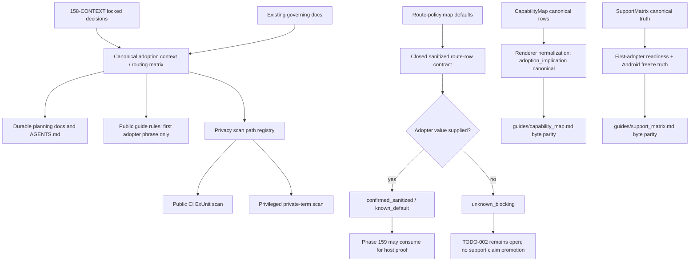

# Phase 158: Adoption Reset and Route Map - Research

**Researched:** 2026-07-31
**Domain:** Elixir/Phoenix planning-truth, deterministic docs, route-policy inventory, privacy scans
**Confidence:** MEDIUM

<user_constraints>
## User Constraints (from CONTEXT.md)

Source: `.planning/phases/158-adoption-reset-and-route-map/158-CONTEXT.md` [VERIFIED: codebase grep]

### Locked Decisions

## Implementation Decisions

### Inventory completion

- **D-01:** Separate **policy-contract completeness** from **adopter-instance completeness**.
  Phase 158 may close when GET-6, v20 stopped/partial truth, public support truth, privacy routing,
  and the known-surface ownership/default map are durable. It must not fabricate adopter-specific
  route facts that have not been supplied.

- **D-02:** Every missing adopter-supplied value uses the explicit state
  `unknown_blocking`. Blank cells, optimistic defaults, inferred product details, and prose that
  can be mistaken for confirmation are forbidden.

- **D-03:** Keep TODO-002 open until sanitized concrete route rows exist. Phase 159 may build the
  configurable host-proof scaffold from the frozen contract, but no external-host proof or
  physical-device support claim may be promoted while required route inputs remain
  `unknown_blocking`.

- **D-04:** If customer Alpha is web-only, complete the bounded reset/inventory and pause
  Crosswake. Resume adopter integration only when the public-v1 mobile path is active.

### Route-row privacy and granularity

- **D-05:** Use a layered inventory: retain a compact product-surface/default-ownership table for
  discovery, then require one sanitized row per concrete Phoenix route pattern before that route
  participates in adopter-host proof. A route pattern is a compiled route such as
  `/study/session/:id`, not a database record, lesson, learner, or other resource instance.

- **D-06:** Family defaults may reduce repetition only for non-sensitive posture. Auth, recent
  auth, scope, mutation, media, fallback, and remote-disable fields must be explicit per concrete
  route; they never inherit silently.

- **D-07:** Route-row status uses the closed vocabulary `confirmed_sanitized`, `known_default`,
  `unknown_blocking`, and `not_applicable`. Unknown safety-critical posture fails closed.

- **D-08:** The durable sanitized row contract contains only:
  opaque route ID; sanitized path pattern; runtime owner; offline posture; low-cardinality mutation
  categories; staleness class; auth level/recent-auth requirement; scope/logout/account-switch
  posture; media requirement with size band, codec family, and integrity requirement; online,
  offline, denied, corrupt-pack, and disabled fallbacks; entry/replay disablement posture; and
  queued-data retention posture.

- **D-09:** Durable route rows must not contain raw/free-form payload examples, learner or customer
  data, account IDs, credentials, tokens, stable device IDs, proprietary curriculum taxonomy,
  exact archive filenames/layout, URLs, CDN/auth details, actual host flag names, product copy,
  price, geography, or revealing links. Exact byte counts, digests, endpoints, and flag names live
  in host configuration when integration begins.

- **D-10:** Validate inventory input as closed, structured data with the same discipline as an
  Ecto embedded schema and changeset: cast only named fields, reject unknown keys, use closed enums,
  require safety fields, and return calm field-specific errors without echoing rejected sensitive
  values. Phase 158 should not add a runtime database or public generic inventory framework merely
  to obtain this validation.

### Capability and support-truth vocabulary

- **D-11:** `adoption_implication` becomes the canonical capability-map vocabulary. The public
  guide continues to render the column as **Adoption implication**.

- **D-12:** Preserve `v20_implication` as a legacy renderer/input alias for one compatibility
  window because `Crosswake.CapabilityMap.canonical/0` and map-based renderer inputs make the row
  shape observable even though `Row` is hidden from generated documentation. Normalize both names
  through one function, prefer the canonical field, and fail if both are present with conflicting
  values. — **Reversibility:** costly — removing the alias immediately could break external
  pattern matches or renderer inputs; later removal needs a documented compatibility change.

- **D-13:** New canonical rows use `adoption_implication`. Historical rows may name v20 as
  provenance, but current recommendations must not present Native Controls Pack 1 as the active
  organizing axis. Tests must prove canonical new-field usage, legacy-map compatibility,
  conflicting-dual-value rejection, and deterministic guide regeneration.

### Context routing and privacy enforcement

- **D-14:** Use one centralized routing matrix with these destinations:
  settled architecture, sanitized route posture, and non-goals in durable git; generic
  first-adopter support claims in public guides; fast-changing execution in codename-only Linear
  issues; exact endpoints/flags/archive metadata/account mapping in the host repository or runtime
  configuration; credentials and private terms in secret storage/environment only; and raw
  answers/media/transcripts/account or device identifiers in none of the planning, telemetry,
  diagnostic, inspection, aggregate, or evidence surfaces.

- **D-15:** Keep scanning scope explicit but drift-checked. Classify active governing documents,
  Phase 158 context/log artifacts, TODO-002, codename-only Linear drafts, `AGENTS.md`, the
  capability map, and support matrix. Exclude historical milestone archives, prompt lineage,
  superseded brand seeds, raw fixtures/evidence, and git history. Never search history or external
  sources to rediscover adopter identity.

- **D-16:** Always-on public CI enforces the codename/public-phrase split, generic prohibited
  identity/commercial patterns, forbidden field vocabulary, routing-matrix coverage, and a
  synthetic private-term canary. It must not claim knowledge of a private term that was not
  supplied.

- **D-17:** A privileged/local scan accepts real prohibited terms through
  `CROSSWAKE_PRIVATE_ADOPTER_TERMS` (or an equivalent secret-backed runtime input). Terms are
  case-insensitive, never printed, persisted, uploaded, embedded in artifacts, or included in test
  failure text. Failures report only a stable rule ID and affected path. Ordinary fork PRs do not
  fail merely because private CI secrets are unavailable; protected adoption-context validation
  must run the privileged check before promotion.

- **D-18:** Credential-oriented scanners may remain later defense-in-depth, but Phase 158 does not
  add a new scanner service or dependency. Their default patterns do not replace the
  adopter-context routing and private-term contract.

### Maintainer experience and communication

- **D-19:** Phase 158 has no new end-user UI. Its primary user experience is the maintainer's
  inventory, validation, and failure-recovery flow. Tables use meaningful headings and text status
  (never color alone); errors name the route reference, missing field, and safe remediation; and
  all copy follows the ratified brand voice: calm, exact, operational, and free of framework
  theatrics.

- **D-20:** Optimize for a solo maintainer: deterministic browser-free ExUnit checks, one canonical
  path matrix, one implication normalizer, no dashboard, no new label family, and no external
  service required for the core Phase 158 proof.

### the agent's Discretion

The user delegated exact implementation mechanics after requesting one coherent, research-backed
recommendation set. Planning may choose the smallest internal module/helper boundaries, exact
status serialization shape, test-fixture names, and compatibility-window removal note that satisfy
the decisions above. It may not weaken explicit unknowns, privacy exclusions, route-local
authority, or proof-promotion gates.

### Deferred Ideas (OUT OF SCOPE)

No `## Deferred Ideas` section was present in `158-CONTEXT.md`; the phase boundary explicitly
excludes proof-lane generator implementation, scoped replay, iOS pack provider, physical-device
proof, dashboard, generic sync/storage, native-control breadth, Android work, and a Crosswake
feature-flag service. [VERIFIED: `.planning/phases/158-adoption-reset-and-route-map/158-CONTEXT.md`]
</user_constraints>

<phase_requirements>
## Phase Requirements

| ID | Description | Research Support |
|----|-------------|------------------|
| RESET-01 | The infrastructure-versus-business-line decision, reversal condition, scope audit, non-goals, and stop list are durable and discoverable. | Use existing durable docs plus `Crosswake.Planning.FirstAdopterContextTest` path existence and phrase checks. [VERIFIED: `.planning/REQUIREMENTS.md`; `test/crosswake/planning/first_adopter_context_test.exs:4`] |
| RESET-02 | Every known first-adopter surface has an explicit runtime owner, offline posture, authority boundary, fallback, and remote-disable posture. | Extend the route-policy map as a layered inventory with closed statuses and `unknown_blocking`; mirror the closed-enum style from `Crosswake.Policy.Schema`. [VERIFIED: `.planning/FIRST-B2C-ADOPTER-ROUTE-POLICY-MAP.md`; `lib/crosswake/policy/schema.ex:16`] |
| RESET-03 | v20 is recorded as stopped/partial without a shipped claim or release tag, and Phases 156-157 are absent from active scope. | Preserve the existing stopped/partial archive and audit truth across milestone docs. [VERIFIED: `.planning/milestones/v20.0-ROADMAP.md:3`; `.planning/MILESTONES.md:3`; `.planning/v20.0-MILESTONE-AUDIT.md:5`] |
| RESET-04 | Planning and public adoption artifacts contain no prohibited adopter identity or personal information. | Centralize path routing and extend the current ExUnit privacy scan to include drift checks, forbidden vocabulary, and private-term canary behavior. [VERIFIED: `test/crosswake/planning/first_adopter_context_test.exs:53`] |
</phase_requirements>

## Summary

Phase 158 should be planned as a small canonical-truth and validation phase, not as product or
runtime implementation. The repo already has the right pattern: canonical Elixir source renders
public Markdown, byte-parity tests prevent drift, and closed route-policy validation rejects
ambiguous inputs. [VERIFIED: `lib/crosswake/capability_map/renderer.ex:18`;
`test/crosswake/capability_map/renderer_test.exs:36`; `lib/crosswake/policy/schema.ex:56`]

The main planning problem is keeping four truth surfaces aligned: durable governing docs, public
support/capability guides, route-inventory data, and privacy scans. Treat Phase 158 completion as
policy-contract completeness only; missing adopter-specific rows stay `unknown_blocking` and keep
TODO-002 open. [VERIFIED: `158-CONTEXT.md` D-01 through D-03]

**Primary recommendation:** Use one small internal adoption context module for path routing/privacy
rules, one closed route-inventory data module or validator for sanitized rows, and targeted renderer
updates/tests for capability/support truth; do not add dependencies, services, dashboards, Android
scope, or runtime proof implementation. [VERIFIED: `158-CONTEXT.md` D-18/D-20]

## Project Constraints (from AGENTS.md)

- Read and preserve the governing first-adopter docs, project state, requirements, roadmap, and route-policy map before planning or implementation. [VERIFIED: `AGENTS.md`]
- Crosswake is infrastructure for the First B2C Adopter, not a separate business line; optimize for one Phoenix application, one physical iPhone, and one offline mutation island. [VERIFIED: `AGENTS.md`]
- Preserve explicit route runtime ownership and the Phoenix-first route-policy thesis; do not collapse the design into generic WebView wrapper behavior or LiveView-driven native rendering. [VERIFIED: `AGENTS.md`]
- Bridge contracts remain semantic, typed, versioned, and low-frequency; continuous client authority belongs in an offline island or native screen. [VERIFIED: `AGENTS.md`]
- Cached read-only is not local mutation; one study island is not generic sync. [VERIFIED: `AGENTS.md`]
- Android is frozen during v21; no Android features, templates, device proof, parity work, or release requirements. [VERIFIED: `AGENTS.md`]
- Do not add native menu/action-button breadth, companions, capture/device packs, commerce productionization, dashboard, brand/showcase polish, generic sync, background sync, or generic native storage unless the ADR reversal condition is met. [VERIFIED: `AGENTS.md`]
- Durable codename is `First B2C Adopter` / `first_b2c_adopter`; public guides say `first adopter`; never record or infer the real adopter name or sensitive adopter facts. [VERIFIED: `AGENTS.md`]
- Do not search git history or external sources to reidentify the adopter. [VERIFIED: `AGENTS.md`]
- Preserve the pre-existing `.planning/config.json` modification; current `git status --short` shows only that file modified before research output. [VERIFIED: `git status --short`]

## Architectural Responsibility Map

| Capability | Primary Tier | Secondary Tier | Rationale |
|------------|-------------|----------------|-----------|
| Durable adoption framing and v20 stopped/partial truth | Planning Docs / Git | ExUnit docs tests | Governing decisions are repo-local truth and must be discoverable by future sessions. [VERIFIED: `.planning/STATE.md`; `test/crosswake/planning/first_adopter_context_test.exs:23`] |
| Public capability/support truth | Core Elixir canonical source | Generated Markdown guides | Existing guides are rendered from `Crosswake.CapabilityMap` and `Crosswake.SupportMatrix`, then byte-checked. [VERIFIED: `lib/crosswake/capability_map/renderer.ex:18`; `lib/crosswake/support_matrix/renderer.ex:18`] |
| Sanitized route inventory | Core Elixir validation / Planning data | Public planning Markdown | Route rows need closed enums, required safety fields, and no host-private details. [VERIFIED: `158-CONTEXT.md` D-05 through D-10] |
| Privacy and context routing | ExUnit / CI | Environment secret input | Existing scan is browser-free ExUnit and already reads `CROSSWAKE_PRIVATE_ADOPTER_TERMS`. [VERIFIED: `test/crosswake/planning/first_adopter_context_test.exs:64`] |
| Host-private exact endpoints, flags, archive metadata, account mapping | Host repo / Runtime config | Secret storage | Crosswake durable docs must not store exact host values. [VERIFIED: `158-CONTEXT.md` D-14] |
| Physical-device proof and replay/media implementation | Later phases / Host integration | iOS shell / backend | Phase 158 explicitly does not implement these. [VERIFIED: `158-CONTEXT.md` phase boundary] |

## Standard Stack

### Core

| Library / Tool | Version | Purpose | Why Standard |
|----------------|---------|---------|--------------|
| Elixir / Mix | 1.19.5 | Core implementation and ExUnit validation | Current local runtime for the repo. [VERIFIED: `elixir --version`; `mix --version`] |
| Phoenix | 1.8.7 | Route metadata and Phoenix-native route-policy integration | Existing dependency and route DSL surface. [VERIFIED: `mix.lock`; `lib/crosswake/router.ex`] |
| Phoenix LiveView | 1.1.30 | Existing LiveView route-owner posture | Existing dependency and route integration surface. [VERIFIED: `mix.lock`; `lib/crosswake/router.ex`] |
| NimbleOptions | 1.1.1 | Closed option validation pattern | Existing `Crosswake.Policy.Schema` uses `NimbleOptions.new!` and `NimbleOptions.validate`. [VERIFIED: `mix.lock`; `lib/crosswake/policy/schema.ex:56`] |
| Jason | 1.4.5 | Existing JSON dependency | Keep using current dependency if structured JSON fixtures are needed. [VERIFIED: `mix.lock`] |
| ExUnit | Built into Elixir 1.19.5 | Browser-free validation, drift checks, privacy scans | Existing tests use ExUnit for planning docs, capability map, support matrix, and route policy. [VERIFIED: `test/crosswake/planning/first_adopter_context_test.exs:1`] |

### Supporting

| Library / Tool | Version | Purpose | When to Use |
|----------------|---------|---------|-------------|
| ExDoc | 0.40.3 | Public docs rendering | Only if the plan touches ExDoc extras/groups; Phase 158 likely needs source-rendered guides plus tests, not a docs build. [VERIFIED: `mix.lock`; `mix.exs`] |
| `rg` | available | Fast path and text scans | Use for drift checks and reviewer verification, but encode permanent checks in ExUnit. [VERIFIED: command execution] |

### Alternatives Considered

| Instead of | Could Use | Tradeoff |
|------------|-----------|----------|
| Small Elixir modules plus ExUnit | External scanner service | Violates D-18/D-20 by adding service/dependency surface for a one-day docs/privacy phase. [VERIFIED: `158-CONTEXT.md` D-18/D-20] |
| Closed data + renderer | Hand-edited Markdown tables only | Hand edits drift from canonical truth and are harder to validate non-vacuously. [VERIFIED: `test/crosswake/capability_map/renderer_test.exs:36`] |
| `unknown_blocking` | Empty cells or inferred defaults | Forbidden by D-02 and unsafe for safety-critical route posture. [VERIFIED: `158-CONTEXT.md` D-02] |

**Installation:**

```bash
# No new packages for Phase 158. Use existing repo dependencies.
mix deps.get
```

## Package Legitimacy Audit

No external packages should be installed for Phase 158. Package legitimacy gate is not required
unless the planner introduces a new dependency, which this research recommends against. [VERIFIED:
`158-CONTEXT.md` D-18/D-20]

| Package | Registry | Age | Downloads | Source Repo | Verdict | Disposition |
|---------|----------|-----|-----------|-------------|---------|-------------|
| none | — | — | — | — | — | No new package approved |

**Packages removed due to [SLOP] verdict:** none
**Packages flagged as suspicious [SUS]:** none

## Architecture Patterns

### System Architecture Diagram



### Recommended Project Structure

```text
lib/crosswake/
├── planning/
│   └── first_adopter_context.ex      # centralized paths, routing destinations, forbidden terms
├── adoption/
│   └── route_inventory.ex            # closed sanitized row contract, if code-backed validation is chosen
├── capability_map.ex                 # migrate canonical field to adoption_implication
├── capability_map/renderer.ex        # normalize legacy alias and render public guide
└── support_matrix/renderer.ex        # first-adopter readiness/non-claim truth

test/crosswake/
├── planning/first_adopter_context_test.exs
├── adoption/route_inventory_test.exs
├── capability_map/capability_map_test.exs
├── capability_map/renderer_test.exs
└── support_matrix/renderer_test.exs
```

### Pattern 1: Canonical Source Renders Markdown

**What:** Keep durable/public truth in code data, render Markdown deterministically, and assert
byte identity. [VERIFIED: `lib/crosswake/capability_map/renderer.ex:18`;
`test/crosswake/capability_map/renderer_test.exs:36`]

**When to use:** Capability map, support matrix, route inventory if the route rows become
machine-validated.

**Example:**

```elixir
# Source: lib/crosswake/capability_map/renderer.ex
def render(rows) when is_list(rows) do
  rows = Enum.map(rows, &normalize_row/1)
  # build sections, then Enum.join("\n")
end
```

### Pattern 2: Closed Validation Before Rendering

**What:** Cast only named fields, keep enums explicit, and reject invalid shapes before docs or
proof can consume them. [VERIFIED: `lib/crosswake/policy/schema.ex:56`;
`lib/crosswake/policy/schema.ex:217`]

**When to use:** Sanitized route-row inventory and `adoption_implication` alias normalization.

**Example:**

```elixir
# Source: lib/crosswake/policy/schema.ex
@schema NimbleOptions.new!(
  id: [type: {:custom, __MODULE__, :validate_identifier, []}, required: true],
  runtime: [type: {:custom, __MODULE__, :validate_runtime, []}, required: true]
)
```

### Pattern 3: Privacy Scan as Product Surface

**What:** Use a central path registry and ExUnit assertions that classify durable docs, public
guides, and privileged private-term checks. [VERIFIED:
`test/crosswake/planning/first_adopter_context_test.exs:4`;
`test/crosswake/planning/first_adopter_context_test.exs:64`]

**When to use:** RESET-04 and context-routing enforcement.

**Example:**

```elixir
# Source: test/crosswake/planning/first_adopter_context_test.exs
private_terms =
  System.get_env("CROSSWAKE_PRIVATE_ADOPTER_TERMS", "")
  |> String.split(",", trim: true)
```

### Anti-Patterns to Avoid

- **Blank route fields:** Use `unknown_blocking`; blank cells are forbidden. [VERIFIED: `158-CONTEXT.md` D-02]
- **Broad support promotion from docs alone:** External-host and physical-device claims stay blocked while route inputs remain `unknown_blocking`. [VERIFIED: `158-CONTEXT.md` D-03]
- **Route family inheritance for safety-critical fields:** Auth, scope, mutation, media, fallback, and remote-disable posture must be explicit per route. [VERIFIED: `158-CONTEXT.md` D-06]
- **New scanner service or dependency:** Phase 158 should stay deterministic and browser-free. [VERIFIED: `158-CONTEXT.md` D-18/D-20]
- **Searching history or external sources for identity:** Explicitly forbidden. [VERIFIED: `AGENTS.md`; `158-CONTEXT.md` D-15]

## Don't Hand-Roll

| Problem | Don't Build | Use Instead | Why |
|---------|-------------|-------------|-----|
| Markdown drift prevention | Manual checklist | Renderer byte-parity ExUnit tests | Existing repo pattern already catches drift mechanically. [VERIFIED: `test/crosswake/support_matrix/renderer_test.exs:7`] |
| Route-row validation | Free-form Markdown parser | Closed Elixir data/validator using the `Policy.Schema` discipline | Unknown keys and unsafe values must fail closed. [VERIFIED: `158-CONTEXT.md` D-10] |
| Privacy scanning | New service, GitHub app, or external DLP | ExUnit path registry plus env-provided private-term scan | D-18 forbids new scanner dependency for Phase 158. [VERIFIED: `158-CONTEXT.md` D-18] |
| Feature flags | Crosswake flag service | Existing host-owned `gated_by` route seam | Server-side disablement remains host-owned. [VERIFIED: `.planning/ADR-FIRST-B2C-ADOPTER.md`; `lib/crosswake/policy/schema.ex:113`] |
| Support taxonomy | New labels | Existing support-truth labels plus first-adopter rows | Roadmap freezes new label families unless current vocabulary is insufficient. [VERIFIED: `.planning/ROADMAP.md`] |

**Key insight:** Phase 158 is a truth-freezing phase. Custom runtime systems would increase the
solo-maintainer surface without proving the adopter route. [VERIFIED: `158-CONTEXT.md` D-20]

## Common Pitfalls

### Pitfall 1: Treating Product-Surface Defaults as Route Facts

**What goes wrong:** A default table looks complete, but concrete Phoenix routes still lack auth,
scope, media, fallback, or disablement facts. [VERIFIED: `158-CONTEXT.md` D-05/D-06]
**How to avoid:** Keep defaults for discovery only; require one sanitized row per route pattern
before Phase 159 proof consumption. [VERIFIED: `158-CONTEXT.md` D-05]
**Warning signs:** Blank cells, "same as family", or route rows without status.

### Pitfall 2: Leaking Host-Private Values Through Helpful Examples

**What goes wrong:** Example routes include raw payloads, exact endpoints, actual flag names, URLs,
or media archive metadata. [VERIFIED: `158-CONTEXT.md` D-09]
**How to avoid:** Store only low-cardinality categories, opaque IDs, size bands, codec families,
and integrity requirement classes. [VERIFIED: `158-CONTEXT.md` D-08]
**Warning signs:** Exact byte counts, SHA values, CDN paths, product copy, or customer terms.

### Pitfall 3: Compatibility Alias Becomes Two Truths

**What goes wrong:** `v20_implication` and `adoption_implication` both persist and diverge. [VERIFIED: `158-CONTEXT.md` D-12]
**How to avoid:** Normalize through one function, prefer `adoption_implication`, accept the legacy
alias for one window, and fail on conflicting dual values. [VERIFIED: `158-CONTEXT.md` D-12/D-13]
**Warning signs:** Tests update renderer strings but not row structs, map input compatibility, or conflict cases.

### Pitfall 4: Privacy Scan Is Explicit but Vacuous

**What goes wrong:** The scan checks a static list, but new active docs are not registered. [VERIFIED: `158-CONTEXT.md` D-15]
**How to avoid:** Centralize scan paths and add drift checks for active governing docs, Phase 158
artifacts, TODO-002, Linear drafts, `AGENTS.md`, capability map, and support matrix. [VERIFIED: `158-CONTEXT.md` D-15]
**Warning signs:** A new first-adopter file can be added without a test failure.

## Code Examples

### Capability Alias Normalization

```elixir
# Source pattern: lib/crosswake/capability_map/renderer.ex normalize_row/1
defp normalize_row(row) when is_map(row) do
  canonical = Map.get(row, :adoption_implication) || Map.get(row, "adoption_implication")
  legacy = Map.get(row, :v20_implication) || Map.get(row, "v20_implication")

  if canonical && legacy && canonical != legacy do
    raise ArgumentError, "conflicting adoption_implication and v20_implication"
  end

  row
  |> Map.put(:adoption_implication, canonical || legacy)
end
```

### Privacy Path Registry Shape

```elixir
# Source pattern: test/crosswake/planning/first_adopter_context_test.exs
@public_guide_paths [
  "guides/capability_map.md",
  "guides/support_matrix.md"
]

for path <- @public_guide_paths do
  contents = File.read!(path)
  assert contents =~ ~r/first adopter|first-adopter/i
  refute contents =~ "First B2C Adopter"
end
```

## State of the Art

| Old Approach | Current Approach | When Changed | Impact |
|--------------|------------------|--------------|--------|
| Native Controls Pack 1 as active organizing axis | First-adopter infrastructure readiness | 2026-07-30 | Capability/support truth must not present native-control breadth as active priority. [VERIFIED: `.planning/ROADMAP.md`; `.planning/milestones/v20.0-ROADMAP.md:3`] |
| `v20_implication` public row vocabulary | `adoption_implication` canonical field, rendered as Adoption implication | Phase 158 decision | Requires compatibility alias and conflict tests. [VERIFIED: `158-CONTEXT.md` D-11/D-12] |
| Example-host proof implies adopter support | External-host proof requires configurable host scaffold and supplied route inputs | v21 reset | No support claim transfers while inputs are `unknown_blocking`. [VERIFIED: `158-CONTEXT.md` D-03] |
| Current privacy test path list | Central routing matrix with drift checks and private-term canary | Phase 158 target | Prevents unregistered active docs from escaping scans. [VERIFIED: `158-CONTEXT.md` D-15/D-16] |

**Deprecated/outdated:**
- Native menu/action-button Phase 156 and Phase 157 hardening bundle are stopped, not active scope. [VERIFIED: `.planning/milestones/v20.0-ROADMAP.md:19`; `.planning/v20.0-MILESTONE-AUDIT.md:137`]
- `v20_implication` remains only as temporary compatibility alias. [VERIFIED: `158-CONTEXT.md` D-12]

## Assumptions Log

| # | Claim | Section | Risk if Wrong |
|---|-------|---------|---------------|
| A1 | A small `Crosswake.Adoption.RouteInventory` module is the best boundary if route-row validation becomes code-backed. [ASSUMED] | Recommended Project Structure | Planner could instead keep validation under `Crosswake.Planning`; either is acceptable if the closed-schema behavior and tests hold. |

## Open Questions

1. **Should the route inventory be code-rendered or Markdown-only with a validation helper?**
   - What we know: D-10 requires closed structured validation, and existing docs use code-rendered truth. [VERIFIED: `158-CONTEXT.md` D-10; `lib/crosswake/capability_map/renderer.ex:18`]
   - What's unclear: Whether Phase 158 should fully code-render route rows now or only validate a YAML/Elixir fixture consumed by the Markdown.
   - Recommendation: Prefer code-backed validation if any route rows are added; otherwise document the contract and keep TODO-002 open.

2. **What concrete route rows can be confirmed in Phase 158?**
   - What we know: Missing adopter-supplied values must be `unknown_blocking`. [VERIFIED: `158-CONTEXT.md` D-02]
   - What's unclear: Whether sanitized concrete route patterns are available in this repo/session.
   - Recommendation: Do not fabricate rows; keep known surface defaults and TODO-002 open until supplied.

## Environment Availability

| Dependency | Required By | Available | Version | Fallback |
|------------|------------|-----------|---------|----------|
| Elixir | ExUnit and core modules | yes | 1.19.5 | Blocking if absent |
| Mix | Test runner and docs helpers | yes | 1.19.5 | Blocking if absent |
| `rg` | Research and possible drift-check commands | yes | available | Use Elixir `File` scans in permanent tests |
| Git | Status/commit if `commit_docs` remains true | yes | available | Manual commit by orchestrator if needed |

**Missing dependencies with no fallback:** none found.

**Missing dependencies with fallback:** none found.

## Validation Architecture

### Test Framework

| Property | Value |
|----------|-------|
| Framework | ExUnit with Mix 1.19.5 [VERIFIED: `mix --version`] |
| Config file | `mix.exs` aliases; standard ExUnit test tree [VERIFIED: `mix.exs`] |
| Quick run command | `mix test test/crosswake/planning/first_adopter_context_test.exs test/crosswake/capability_map test/crosswake/support_matrix` |
| Full suite command | `mix test --exclude requires_example_host --exclude advisory_only` |

### Phase Requirements -> Test Map

| Req ID | Behavior | Test Type | Automated Command | File Exists? |
|--------|----------|-----------|-------------------|--------------|
| RESET-01 | Durable docs, AGENTS guide, state, roadmap, stop list discoverable | unit/docs | `mix test test/crosswake/planning/first_adopter_context_test.exs` | yes |
| RESET-02 | Route inventory uses explicit owners/posture/status and `unknown_blocking` for missing inputs | unit/docs | `mix test test/crosswake/adoption/route_inventory_test.exs` | no - Wave 0 |
| RESET-03 | v20 stopped/partial archive and Phase 156-157 exclusion remain true | unit/docs | `mix test test/crosswake/planning/first_adopter_context_test.exs` | partial - extend |
| RESET-04 | Public/durable artifact privacy scan, private-term env scan, canary, and path drift checks | unit/security | `CROSSWAKE_PRIVATE_ADOPTER_TERMS=synthetic-private-term mix test test/crosswake/planning/first_adopter_context_test.exs` | partial - extend |

### Sampling Rate

- **Per task commit:** `mix test test/crosswake/planning/first_adopter_context_test.exs test/crosswake/capability_map test/crosswake/support_matrix`
- **Per wave merge:** `mix test --exclude requires_example_host --exclude advisory_only`
- **Phase gate:** Full suite green plus `git diff --check` before verification.

### Wave 0 Gaps

- [ ] `test/crosswake/adoption/route_inventory_test.exs` - covers RESET-02 route-row vocabulary, required fields, sensitive-field rejection, and `unknown_blocking`.
- [ ] Extend `test/crosswake/planning/first_adopter_context_test.exs` - covers RESET-01/RESET-03/RESET-04 path routing, v20 stopped/partial truth, active-scope exclusion, private-term canary, and drift checks.
- [ ] Extend `test/crosswake/capability_map/capability_map_test.exs` and `renderer_test.exs` - covers `adoption_implication`, legacy alias compatibility, conflict rejection, and byte-identical guide rendering.
- [ ] Extend `test/crosswake/support_matrix/renderer_test.exs` - covers first-adopter readiness, Android freeze, support status is not device proof, and public guide phrase only.

## Security Domain

Security enforcement is enabled because `.planning/config.json` does not explicitly set
`security_enforcement: false`. [VERIFIED: `.planning/config.json`]

### Applicable ASVS Categories

OWASP ASVS is currently at stable 5.0.0 and is a basis for testing web application technical
security controls. [CITED: https://owasp.org/www-project-application-security-verification-standard/]
The ASVS 5.0.x index includes categories for encoding/sanitization, validation/business logic,
web frontend security, API/web service, cryptography, configuration, data protection, secure
coding/architecture, and security logging/error handling. [CITED: https://cheatsheetseries.owasp.org/IndexASVS.html]

| ASVS Category | Applies | Standard Control |
|---------------|---------|-----------------|
| V1 Encoding and Sanitization | yes | Escape Markdown table cells in renderers and reject sensitive free-form route fields. [VERIFIED: `lib/crosswake/capability_map/renderer.ex:182`] |
| V2 Validation and Business Logic | yes | Closed route-row validation with required safety fields and `unknown_blocking`. [VERIFIED: `158-CONTEXT.md` D-07/D-10] |
| V3 Web Frontend Security | no | No frontend UI is added in Phase 158. [VERIFIED: `158-CONTEXT.md` D-19] |
| V4 API and Web Service | no | No API endpoint is added in Phase 158. [VERIFIED: phase boundary] |
| V11 Cryptography | limited | Do not store exact digests/secrets; integrity requirement class only in durable route rows. [VERIFIED: `158-CONTEXT.md` D-08/D-09] |
| V13 Configuration | yes | Private terms supplied only through env/secret input and never printed. [VERIFIED: `158-CONTEXT.md` D-17] |
| V14 Data Protection | yes | Raw answers, media, transcripts, credentials, account identifiers, tokens, and stable device IDs forbidden from planning/public/proof surfaces. [VERIFIED: `AGENTS.md`; `158-CONTEXT.md` D-14] |
| V15 Secure Coding and Architecture | yes | Preserve host-owned authority boundaries and fail-closed route posture. [VERIFIED: `AGENTS.md`; `158-CONTEXT.md` D-06] |
| V16 Security Logging and Error Handling | yes | Failure messages report stable rule ID and path, not private term values. [VERIFIED: `158-CONTEXT.md` D-17] |

### Known Threat Patterns for Phase 158

| Pattern | STRIDE | Standard Mitigation |
|---------|--------|---------------------|
| Sensitive adopter term appears in durable docs or public guides | Information Disclosure | Central path registry, generic prohibited regexes, private-term env scan, no term echo. [VERIFIED: `158-CONTEXT.md` D-16/D-17] |
| Unknown route posture promoted as support claim | Tampering / Elevation of Privilege | `unknown_blocking` fails closed and blocks Phase 159 proof consumption. [VERIFIED: `158-CONTEXT.md` D-02/D-03] |
| Route safety fields inherit silently from family defaults | Spoofing / Tampering | Require route-local auth, scope, mutation, media, fallback, and disablement fields. [VERIFIED: `158-CONTEXT.md` D-06] |
| Public guide uses durable codename | Information Disclosure | Public guide scan requires generic `first adopter` phrase and rejects `First B2C Adopter`. [VERIFIED: `test/crosswake/planning/first_adopter_context_test.exs:46`] |
| Failure output leaks secret terms | Information Disclosure | Report only stable rule ID and path. [VERIFIED: `158-CONTEXT.md` D-17] |

## Sources

### Primary (HIGH confidence)

- `.planning/phases/158-adoption-reset-and-route-map/158-CONTEXT.md` - locked Phase 158 decisions and boundaries.
- `AGENTS.md` - project constraints, privacy rules, Android freeze, workflow rules.
- `.planning/REQUIREMENTS.md`, `.planning/ROADMAP.md`, `.planning/STATE.md` - RESET requirements and active milestone state.
- `.planning/ADR-FIRST-B2C-ADOPTER.md`, `.planning/FIRST-B2C-ADOPTER-ADOPTION-BRIEF.md`, `.planning/FIRST-B2C-ADOPTER-ROUTE-POLICY-MAP.md` - governing first-adopter strategy.
- `lib/crosswake/capability_map.ex`, `lib/crosswake/capability_map/renderer.ex`, `lib/crosswake/support_matrix/renderer.ex` - canonical truth and renderer patterns.
- `lib/crosswake/policy/schema.ex`, `lib/crosswake/policy/route.ex`, `lib/crosswake/router.ex` - closed schema and route-policy precedent.
- `test/crosswake/planning/first_adopter_context_test.exs`, `test/crosswake/capability_map/*`, `test/crosswake/support_matrix/*` - existing validation patterns.
- `.planning/milestones/v20.0-ROADMAP.md`, `.planning/milestones/v20.0-REQUIREMENTS.md`, `.planning/v20.0-MILESTONE-AUDIT.md`, `.planning/MILESTONES.md` - v20 stopped/partial truth.

### Secondary (MEDIUM confidence)

- OWASP ASVS project page - current ASVS purpose and 5.0.0 stable reference: https://owasp.org/www-project-application-security-verification-standard/
- OWASP Cheat Sheet ASVS index - ASVS 5.0.x category index: https://cheatsheetseries.owasp.org/IndexASVS.html

### Tertiary (LOW confidence)

- Research-plan seam classified the internal codebase digest provider as LOW because `codebase` is not a recognized high-confidence external provider in this seam; the underlying findings are direct repo reads, not web-only claims.

## Metadata

**Confidence breakdown:**
- Standard stack: HIGH - direct `mix.exs`, `mix.lock`, and local version commands.
- Architecture: HIGH - direct repo patterns and locked context decisions.
- Pitfalls: HIGH - derived from locked user decisions and existing tests.
- External security taxonomy: MEDIUM - official OWASP pages checked on 2026-07-31.

**Research date:** 2026-07-31
**Valid until:** 2026-08-07 for ASVS/security references; 2026-08-30 for local codebase patterns unless Phase 158 implementation changes them.
