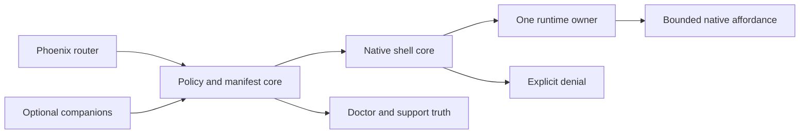
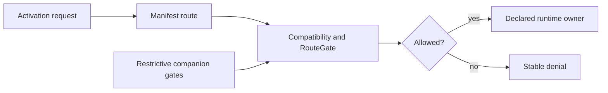
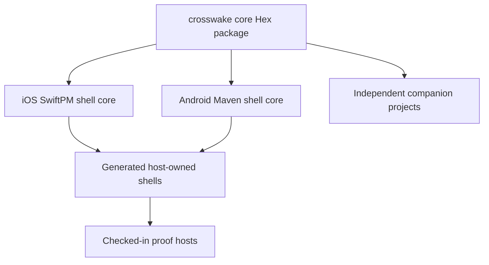

# Architecture

## Opening promise

Crosswake makes one decision explicit for every Phoenix route: **which runtime owns the
screen and its state?** A route can stay with LiveView, become a local-first offline
island, or move to a native screen. Crosswake carries that declaration across the
Phoenix/native boundary and refuses to guess when the contract does not hold.

That makes Crosswake a Phoenix-first route-policy and runtime-contract system. It is
not a universal UI framework, a generic WebView wrapper, or a way for native code to
take over Phoenix application state.

## Crosswake in one picture



The central line is deliberately short. Phoenix declares ownership. Crosswake turns
the declaration into shared truth. The shell consumes that truth and either selects
one owner or stops with a typed denial. The bridge, companions, and diagnostics refine
or explain that decision; none of them becomes a second owner.

## Vocabulary for the trip

A **managed route** is a Phoenix route with `crosswake:` metadata. Its **runtime owner**
is `:live_view`, `:offline_island`, or `:native_screen`. A **manifest** is the versioned,
deterministic runtime document compiled from all managed routes.

An **activation** is a cold start, deep link, notification, or in-app navigation request
evaluated against that manifest. A **capability** is a named native affordance a route
declares, such as `share`; it is permission to ask, not authority over the route. A
compatibility **finding** is structured evidence from a check. A **denial** is the stable,
runtime-facing result that stops or redirects activation.

A **companion** is an optional package that can further restrict a route around an
external integration. A **proof class** says what kind of evidence backs a claim. A
**rebuild posture** says whether a contract change needs only an Elixir deployment or
also a new native binary.

## Journey 1: a route becomes shared runtime truth

The author writes ownership beside the route it governs:

```elixir
live("/bridge-proof", CrosswakeExample.BridgeProofLive,
  crosswake: [
    id: "bridge-proof",
    runtime: :live_view,
    capabilities: ["share"],
    offline: :cached_read_only,
    security: :standard
  ]
)
```

The value crossing the first boundary is ordinary Phoenix route metadata. Phoenix owns
routing and LiveView's server-owned UI lifecycle; `Crosswake.Router` owns the meaning of
the `crosswake:` options it attaches. Unmanaged routes remain Phoenix routes and do not
silently acquire a mobile contract.

```mermaid
flowchart LR
  accTitle: From route declaration to shared manifest
  accDescr: Crosswake attaches route metadata, applies defaults, normalizes option shapes, checks route semantics, builds and validates the manifest, then serializes deterministic JSON.
  Metadata[Router metadata] --> Defaults[Defaults and normalization]
  Defaults --> Schema[Schema validation]
  Schema --> Semantics[Semantic validation]
  Semantics --> Build[Manifest build]
  Build --> Validate[Manifest validation]
  Validate --> JSON[Deterministic JSON]
```



`Crosswake.Policy.Compiler.compile/2` separates managed routes, calls
`Crosswake.Policy.Route.new/1`, checks duplicate IDs, and runs cross-field semantics in
`Crosswake.Policy.Validator`. NimbleOptions validates option shapes. Crosswake still
owns the combinations that are meaningful: a LiveView cannot claim local-first
ownership, an offline island cannot be unavailable offline, and a declared capability
requires an explicit security posture.

`Crosswake.Manifest.compile/2` then builds route entries and registries, validates the
whole document, and renders it through `Crosswake.Manifest.Serializer`. Jason provides
JSON encoding; Crosswake orders every map before encoding so equivalent policy produces
stable artifact bytes.

The manifest, rather than raw router declarations, crosses into the shell:

```elixir
%{
  "manifest_schema_version" => "1.0.0",
  "routes" => %{
    "bridge-proof" => %{
      "runtime" => "live_view",
      "offline" => "cached_read_only",
      "capabilities" => ["share"]
    }
  }
}
```

Malformed declarations leave a diagnostic with route identity, source context, a
message, and usually a repair hint. Invalid manifest truth is never emitted as a runtime
artifact. This boundary exists so native activation consumes a small, versioned contract
instead of trying to interpret Phoenix internals.

## Journey 2: activation chooses an owner or stops

At runtime, the shell normalizes an entry event into an activation request. The request
carries the desired route or URL, entry source, origin, manifest source, contract
versions, installed packs, available capabilities, and a correlation ID.



`Crosswake.Shell.Activation.resolve/2` resolves a route ID and asks
`Crosswake.Compatibility.RouteGate.evaluate/4` for a decision. Core compatibility checks
cover route presence, entry policy, versions, origin, packs, capabilities, and other
manifest truth. Registered companions may add dependency, kill-switch, feature-gate,
or auth restrictions, but they cannot reopen a core denial.

An allowed decision contains exactly the manifest route's runtime and path:

```elixir
%Crosswake.Shell.Activation.Decision{
  status: :allow,
  route_id: "bridge-proof",
  runtime: :live_view,
  route_path: "/bridge-proof",
  denial: nil
}
```

A failed check becomes a `Crosswake.Shell.Denial`, not a generic-container fallback.
The activation source and route's declared `on_unavailable` posture determine whether
the shell halts, stays put, or follows an explicit Phoenix fallback. The denial preserves
the route, reason, human message, recovery hint, and structured details. That evidence
lets the host explain a stop without weakening it.

## A bounded bridge is not a second application runtime

Once a Phoenix-owned route is active, it may ask for one declared native affordance.
`Crosswake.Bridge.Contract` defines a closed, versioned request/reply vocabulary;
`Crosswake.Bridge.Registry.lookup/4` requires a supported command, an active manifest
route, and the matching declared capability or transfer.

```elixir
Crosswake.Bridge.Contract.new_request(
  command: "share.invoke",
  capability: "share",
  route_id: "bridge-proof",
  active_route_id: "bridge-proof",
  origin: "https://example.invalid",
  native_runtime_version: "1.0.0",
  correlation_id: "share-42",
  capabilities: %{"share" => "1.0.0"},
  payload: %{"text" => "Runtime ownership stays explicit."}
)
```

The native Swift and Kotlin channels add runtime defenses: active-route equality,
allowlisted origin, compatible protocol/runtime versions, pack requirements, capability
versions, and configured delegate availability. Replies retain the command, route, and
correlation ID.

This seam is semantic, typed, and low-frequency. It is not navigation authority, a
general event bus, or native control of LiveView state. A flow that needs continuous
client authority belongs in an offline island or native screen. The checked-in example
host currently demonstrates `share.invoke` with host-written message-handler script;
that script is executable proof plumbing, not stable library API.

## Offline, packs, transfers, commerce, and auth hang from ownership

These declarations refine a route owner rather than creating competing architectures:

| Declaration | What it adds without changing the owner |
| --- | --- |
| `offline: :cached_read_only` | A bounded stale-read posture; Phoenix remains authoritative and mutation is unavailable. |
| `runtime: :offline_island`, `offline: :local_first` | Client-owned mutation with an island contract, journal/outbox, and reconciliation. |
| Packs | Versioned content or runtime prerequisites checked before activation. |
| Transfers | Named import, export, download, or upload seams with verification posture. |
| Commerce and auth | Backend-authoritative corridors and predicates, optionally restricted by companions. |

Cached read-only behavior is not local-first mutation. A file picked on-device is not
backend evidence until the declared transfer and host workflow verify it. A provider or
client auth signal does not promote server authority by itself. Crosswake core owns no
database; host applications or optional packages own durable journals, outboxes, audit
records, correlation, and external-engine state.

The focused guides go deeper: [Offline](offline.md), [Packs and transfers](packs.md),
[Commerce](commerce.md), [Capabilities](capabilities.md), and
[Companion contracts](companion_contract.md).

## The package family preserves optionality



The core Hex package owns policy, manifests, activation semantics, bridge vocabulary,
diagnostics, and stable telemetry event contracts. The reusable iOS and Android shell
cores own manifest consumption, native runtime selection, delegate seams, and native
contract enforcement. Generated shells belong to adopters after generation; checked-in
Phoenix, iOS, and Android hosts are integration and proof surfaces rather than public
library API.

Rulestead, Rindle, Sigra, Chimeway, and Threadline are five independently versioned
in-repository package projects. Core never compile-depends on a companion, and
companions do not form a production dependency chain with one another. Repository
presence is not a publication claim: use `mix crosswake.release.status --live` for
current registry truth and [Companion compatibility](companion_compatibility.md) for
version floors.

See [Install](install.md), [Native shell](native_shell.md),
[Native shell upgrades](native_shell_upgrade.md), and [Companions](companions.md) for
the operational paths.

## Support truth is part of the runtime contract

`Crosswake.Doctor.run/1` compiles current router truth and combines install, shell,
bridge, offline, companion, compatibility, support, and release-readiness findings.
`Crosswake.SupportMatrix` gives those findings public vocabulary. `:telemetry` dispatches
events; Crosswake owns stable event names, metadata policy, and redaction, while hosts
choose handlers and storage.

Proof labels stay deliberately separate:

- Browser assertions prove the Phoenix path they exercise.
- Hermetic Swift and Kotlin package tests prove reusable native contract behavior
  without a simulator or emulator.
- Emulator, physical-device, and provider evidence each answer different questions and
  may remain advisory or verification-required.
- Live publication evidence proves registry presence, not behavioral breadth.

`Crosswake.Bridge.Contract.version/0` is the canonical bridge-protocol version.
`mix crosswake.contract.gen` renders dependent fixtures and Elixir/Swift/Kotlin contract
vectors. Generate-and-diff checks, drift tests, native tests, and doctor parity findings
force those surfaces to move together. A protocol-axis change also carries an explicit
rebuild posture; regeneration is contract work, not formatting.

Read [Support matrix](support_matrix.md), [Compatibility](compatibility.md),
[Telemetry](telemetry.md), and [Troubleshooting](troubleshooting.md) for the precise
labels and repair paths.

## Module atlas

| Reader question | Start here |
| --- | --- |
| How does Phoenix metadata become policy? | `Crosswake.Router`, `Crosswake.Policy.Compiler`, `Crosswake.Policy.Route` |
| Which route combinations are legal? | `Crosswake.Policy.Schema`, `Crosswake.Policy.Validator` |
| How is runtime truth built and stabilized? | `Crosswake.Manifest`, `Crosswake.Manifest.Builder`, `Crosswake.Manifest.Validator`, `Crosswake.Manifest.Serializer` |
| Why did activation allow or deny? | `Crosswake.Shell.Activation`, `Crosswake.Compatibility.RouteGate`, `Crosswake.Compatibility` |
| Can this route invoke a native command? | `Crosswake.Bridge.Contract`, `Crosswake.Bridge.Registry` |
| Where can optional integrations restrict access? | `Crosswake.Companion` and the configured runtime companion registry |
| What should an operator inspect? | `Crosswake.Doctor`, `Crosswake.SupportMatrix`, `Crosswake.Telemetry` |
| What enforces the same contract natively? | The documented SwiftPM and Maven shell-core package surfaces |

## Code-reading routes

Pick one question and follow values rather than directories:

- Policy to artifact: `Crosswake.Router` → `Crosswake.Policy.Compiler` →
  `Crosswake.Manifest` → `Crosswake.Manifest.Serializer`.
- Entry to owner: `Crosswake.Shell.Activation` →
  `Crosswake.Compatibility.RouteGate` → `Crosswake.Shell.Denial`.
- Native affordance: `Crosswake.Bridge.Contract` → `Crosswake.Bridge.Registry` → the
  Swift/Kotlin bridge package surface.
- Optional restriction: `Crosswake.Companion` → RouteGate's configured registry → one
  companion package.
- Operational truth: `Crosswake.Doctor` → `Crosswake.SupportMatrix` →
  `Crosswake.Telemetry`.

The [Code walkthrough](code-walkthrough.md) follows the first three trails with current
excerpts. The [Route policy](route_policy.md) and [Bridge](bridge.md) guides provide
task-oriented usage.

## Changing Crosswake safely

Preserve these invariants when changing the system:

- Keep one explicit runtime owner per managed route and activation fail-closed.
- Treat the manifest as the authoring/runtime boundary; do not teach native code to
  interpret Phoenix internals.
- Keep bridge commands closed, semantic, versioned, route-local, and correlated.
- Let companions restrict, never reopen, and keep core free of companion compile-time
  dependencies.
- Keep generated and native contract surfaces derived from canonical truth and guarded
  against drift.
- Match support claims to their proof class and rebuild posture.

Router/policy, manifest, activation, bridge-vector, contract-drift, package-isolation,
native-package, doctor, and Hex-page suites state these invariants more precisely than
historical prose. Update the right proof when a contract intentionally changes.

## Where to go next

Continue with the [Code walkthrough](code-walkthrough.md) to see the values cross each
boundary. For adoption work, use [See It Run](see_it_run.md),
[Route policy](route_policy.md), [Install](install.md), and
[Web-to-mobile migration](web_to_mobile_migration.md). For production diagnosis, start
with [Support matrix](support_matrix.md) and [Troubleshooting](troubleshooting.md).
